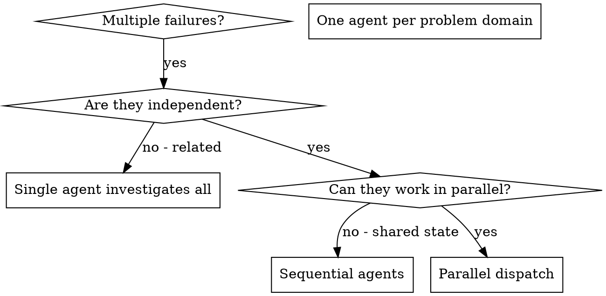

# Dispatching Parallel Agents

<!-- CANONICAL: shared/dispatch-convention.md -->

## Overview

When you have multiple unrelated failures (different test files, different subsystems, different bugs), investigating them sequentially wastes time. Each investigation is independent and can happen in parallel.

**Core principle:** Dispatch one agent per independent problem domain. Let them work concurrently.

## When to Use



**Use when:**
- 3+ test files failing with different root causes
- Multiple subsystems broken independently
- Each problem can be understood without context from others
- No shared state between investigations

**Don't use when:**
- Failures are related (fix one might fix others)
- Need to understand full system state
- Agents would interfere with each other

## The Pattern

### 1. Identify Independent Domains

Group failures by what's broken:
- File A tests: Tool approval flow
- File B tests: Batch completion behavior
- File C tests: Abort functionality

Each domain is independent - fixing tool approval doesn't affect abort tests.

### 2. Create Focused Agent Tasks

Each agent gets:
- **Specific scope:** One test file or subsystem
- **Clear goal:** Make these tests pass
- **Constraints:** Don't change other code
- **Expected output:** Summary of what you found and fixed

### 2.5. Pre-Dispatch File Overlap Analysis

Before spawning agents, determine which files each task will modify:

1. **Build a file-touch map** — For each task, use grep/read to check imports, references, and likely edit targets:
   ```
   Task A → [src/agents/abort.ts, src/agents/abort.test.ts]
   Task B → [src/batch/completion.ts, src/batch/completion.test.ts]
   Task C → [src/agents/abort.ts, src/agents/approval.ts]
   ```
2. **Check for overlaps** — If ANY files appear in more than one task's list, those tasks CANNOT run in parallel. Either sequence them (run one after the other) or merge them into a single agent.
3. **Present the map to the user before dispatching:**
   ```
   "Tasks A and C overlap on src/agents/abort.ts — sequencing C after A."
   ```

Do NOT proceed to dispatch until the file-touch map is clear and all overlaps are resolved.

## MANDATORY CHECKPOINT - DO NOT SKIP

### 2.6. Confirm Dispatch Plan

Present the file-touch map, branch plan, and sequencing decisions to the user:
```
Dispatch plan:
- Agent 1 (parallel/fix-abort): [src/agents/abort.ts, abort.test.ts]
- Agent 2 (parallel/fix-batch): [src/batch/completion.ts, completion.test.ts]
- Agent 3 (parallel/fix-approval): [src/agents/approval.ts] — sequenced after Agent 1 (overlap on abort.ts)

Proceed? (y/n)
```

**STOP. Wait for explicit user confirmation before dispatching agents.** Do not proceed on silence or assume approval.

### 2.75. Branch Isolation

Each parallel agent MUST work on an isolated branch:

1. **One branch per agent** — Create a dedicated branch before dispatch. Naming convention: `parallel/<task-name>` (e.g., `parallel/fix-abort-tests`, `parallel/fix-batch-completion`).
2. **NEVER have two agents write to the same branch.**
3. **Explicit file-scope boundary** — Each agent's prompt MUST include: "You may ONLY modify these files: [list]. Do NOT touch any other files."
4. **Scope enforcement** — After an agent completes, verify its changes. If it touched files outside its assigned scope, reject the output and reassign the task with stricter constraints. The file-touch map is a best-effort prediction — agents MUST include their actual files-modified list in their output summary so the orchestrator can detect unexpected overlaps before merging.

### 3. Dispatch in Parallel

Use disk-mediated dispatch (see `shared/dispatch-convention.md`) to write dispatch files, then spawn agents:

```markdown
# Write dispatch files to /tmp/crucible-dispatch-<session-id>/
# Each file contains the full prompt, constraints, and expected output format.

dispatch-001-abort-tests.md    → Agent 1: Fix agent-tool-abort.test.ts
dispatch-002-batch-tests.md    → Agent 2: Fix batch-completion-behavior.test.ts
dispatch-003-race-tests.md     → Agent 3: Fix tool-approval-race-conditions.test.ts

# Spawn all three agents concurrently, each reading its dispatch file.
```

### 4. Review and Integrate

When agents return:
- Read each summary
- Verify fixes don't conflict
- Run full test suite
- Integrate all changes

#### Sequential Merge Protocol

Merge agent branches one at a time to catch regressions early:

1. **Confirm the merge approach with the user before starting parallel work.**
2. After each agent completes, merge branches ONE AT A TIME: `git merge parallel/<task-name>`
3. Between each merge, run the full test suite locally.
4. If the project has CI configured, push and verify CI passes before proceeding to the next merge. If CI between every merge is impractical, at minimum run CI after the final merge.
5. If merge conflicts arise, resolve them before starting the next merge.
6. If tests fail after a merge, identify which agent's changes caused the regression and fix before continuing.
7. Only proceed to the next branch merge after the current one is green.

## Agent Prompt Structure

Good agent prompts are:
1. **Focused** - One clear problem domain
2. **Self-contained** - All context needed to understand the problem
3. **Specific about output** - What should the agent return?

```markdown
Fix the 3 failing tests in src/agents/agent-tool-abort.test.ts:

1. "should abort tool with partial output capture" - expects 'interrupted at' in message
2. "should handle mixed completed and aborted tools" - fast tool aborted instead of completed
3. "should properly track pendingToolCount" - expects 3 results but gets 0

These are timing/race condition issues. Your task:

1. Read the test file and understand what each test verifies
2. Identify root cause - timing issues or actual bugs?
3. Fix by:
   - Replacing arbitrary timeouts with event-based waiting
   - Fixing bugs in abort implementation if found
   - Adjusting test expectations if testing changed behavior

Do NOT just increase timeouts - find the real issue.

Return: Summary of what you found and what you fixed.
```

## Common Mistakes

**❌ Too broad:** "Fix all the tests" - agent gets lost
**✅ Specific:** "Fix agent-tool-abort.test.ts" - focused scope

**❌ No context:** "Fix the race condition" - agent doesn't know where
**✅ Context:** Paste the error messages and test names

**❌ No constraints:** Agent might refactor everything
**✅ Constraints:** "Do NOT change production code" or "Fix tests only"

**❌ Vague output:** "Fix it" - you don't know what changed
**✅ Specific:** "Return summary of root cause and changes"

## When NOT to Use

**Related failures:** Fixing one might fix others - investigate together first
**Need full context:** Understanding requires seeing entire system
**Exploratory debugging:** You don't know what's broken yet
**Shared state:** Agents would interfere (editing same files, using same resources)
**Overlapping files:** Agents would modify overlapping files (sequence them instead)

## Real Example from Session

**Scenario:** 6 test failures across 3 files after major refactoring

**Failures:**
- agent-tool-abort.test.ts: 3 failures (timing issues)
- batch-completion-behavior.test.ts: 2 failures (tools not executing)
- tool-approval-race-conditions.test.ts: 1 failure (execution count = 0)

**Decision:** Independent domains - abort logic separate from batch completion separate from race conditions

**Dispatch** (disk-mediated, one dispatch file per agent):
```
dispatch-001-abort.md     → Agent 1: Fix agent-tool-abort.test.ts
dispatch-002-batch.md     → Agent 2: Fix batch-completion-behavior.test.ts
dispatch-003-race.md      → Agent 3: Fix tool-approval-race-conditions.test.ts
```

**Results:**
- Agent 1: Replaced timeouts with event-based waiting
- Agent 2: Fixed event structure bug (threadId in wrong place)
- Agent 3: Added wait for async tool execution to complete

**Integration:** All fixes independent, no conflicts, full suite green

**Time saved:** 3 problems solved in parallel vs sequentially

## Key Benefits

1. **Parallelization** - Multiple investigations happen simultaneously
2. **Focus** - Each agent has narrow scope, less context to track
3. **Independence** - Agents don't interfere with each other
4. **Speed** - 3 problems solved in time of 1

## Verification

After agents return:
1. **Review each summary** - Understand what changed
2. **Check for conflicts** - Did agents edit same code?
3. **Run full suite** - Verify all fixes work together
4. **Spot check** - Agents can make systematic errors

## Gate Execution Ledger

Before completing this skill, confirm every mandatory checkpoint was executed:

- [ ] File overlap analysis completed
- [ ] Dispatch plan confirmed by user
- [ ] Branch isolation verified (one branch per agent)
- [ ] Review and integrate (conflict check + full suite)
- [ ] Sequential merge with tests between each

**If any checkbox is unchecked, STOP. Go back and execute the missed gate.**

## Real-World Impact

From debugging session (2025-10-03):
- 6 failures across 3 files
- 3 agents dispatched in parallel
- All investigations completed concurrently
- All fixes integrated successfully
- Zero conflicts between agent changes
