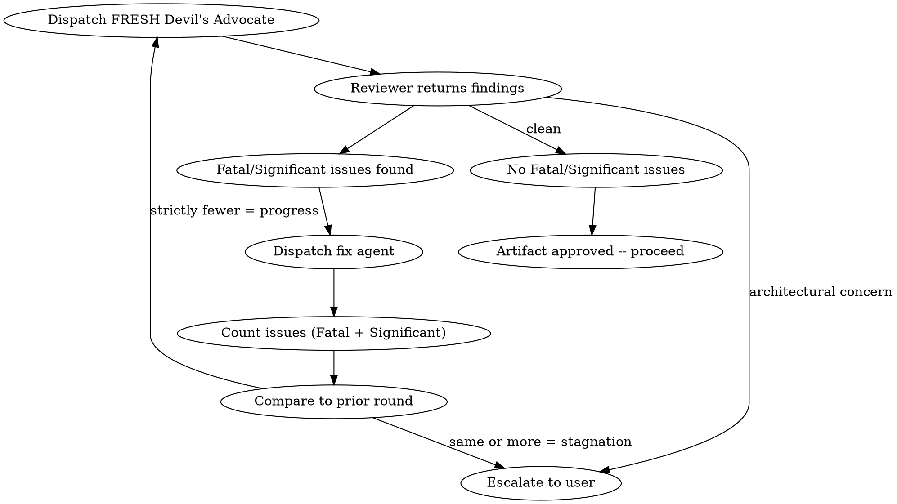

# Iterative Red-Team and Innovation Pipeline Implementation Plan

> **For Claude:** REQUIRED SUB-SKILL: Use crucible:executing-plans to implement this plan task-by-task.

**Goal:** Add iterative adversarial review loops, standalone red-team and innovate skills, and port executing-plans to crucible — making every quality gate iterate until clean.

**Architecture:** Two new standalone skills (`red-team`, `innovate`) plus iterative loops added to all existing review touchpoints. A standalone `executing-plans` skill ported from superpowers. All review loops use the same pattern: fresh reviewer each round, stagnation detection via issue count, escalation to user on stagnation.

**Tech Stack:** Markdown skill files, prompt templates. No code — all documentation.

**Design doc:** `docs/plans/2026-02-23-iterative-red-team-design.md`

---

## Task 1: Create the `red-team` Skill

- **Files:** `skills/red-team/SKILL.md` (create), `skills/red-team/red-team-prompt.md` (move from `skills/build/red-team-prompt.md`)
- **Complexity:** Medium
- **Dependencies:** None

### Step 1: Create `skills/red-team/SKILL.md`

Create the file with this exact content:

```markdown
---
name: red-team
description: Use when you need adversarial review of any artifact — design docs, implementation plans, code, PRs, or documentation. Iterates until clean or stagnation.
---

# Red Team

## Overview

Adversarial review of any artifact. Dispatches a Devil's Advocate subagent to attack the work, fixes findings, then dispatches a FRESH Devil's Advocate to attack again. Iterates until clean or stagnation is detected.

**Core principle:** Fresh eyes every round. No anchoring, no confirmation bias.

**Announce at start:** "I'm using the red-team skill to adversarially review this artifact."

## When to Use

- After a design doc is finalized (before planning)
- After an implementation plan passes review (before execution)
- After implementation is complete (before finishing)
- Anytime you want adversarial review of any artifact
- When the build pipeline calls for red-teaming

## The Iterative Loop



### Rules

1. **Fresh reviewer every round** — dispatch a NEW subagent each time. Never pass prior findings to the next reviewer. Each reviewer sees the artifact cold.
2. **Stagnation = escalation** — if Round N+1 finds >= the number of Fatal+Significant issues as Round N, stop and escalate to user with full findings from both rounds.
3. **Architectural concerns bypass the loop** — immediate escalation regardless of round or progress.
4. **No round cap** — loop as long as each round makes progress.
5. **Only Fatal and Significant count** — Minor observations are logged but don't count toward stagnation and don't trigger fix rounds.

### Issue Classification

The Devil's Advocate MUST classify every challenge:
- **Fatal:** Artifact will fail or produce broken output. Must be addressed.
- **Significant:** Artifact will work but has a meaningful risk or missed opportunity. Should be addressed.
- **Minor:** Nitpick or preference. Log it but don't block.

## How to Use

### 1. Determine artifact type and fix mechanism

| Artifact | Fix Mechanism |
|---|---|
| Design doc | Plan Writer subagent revises the doc |
| Implementation plan | Plan Writer subagent revises the plan |
| Code / implementation | Fix subagent (new, not the original implementer) |
| Documentation | Fix subagent or orchestrator if trivial |
| Standalone invocation | Caller decides |

### 2. Dispatch Devil's Advocate

Use the `red-team-prompt.md` template in this directory. Provide:
- The full artifact content (paste it, don't make the subagent read files)
- Project context (existing systems, constraints, tech stack)
- What the artifact is supposed to accomplish

Model: **Opus** (adversarial analysis needs the best model)

### 3. Process findings

- **No Fatal/Significant issues:** Artifact is approved. Proceed.
- **Fatal/Significant issues found:** Record the issue count. Dispatch fix mechanism. Then go to step 4.
- **Architectural concerns:** Escalate to user immediately. Do not attempt to fix.

### 4. Re-review after fixes

Dispatch a NEW Devil's Advocate subagent (fresh, no prior context). Compare issue count:
- **Strictly fewer Fatal+Significant issues:** Progress. Loop back to step 3.
- **Same or more Fatal+Significant issues:** Stagnation. Escalate to user with findings from both rounds.

## What the Devil's Advocate is NOT

- A code reviewer (don't check style, naming, or quality — that's `crucible:requesting-code-review`)
- A blocker for the sake of blocking — challenges must be specific and actionable
- A rewriter — they challenge, they don't produce an alternative

## Red Flags

**Never:**
- Reuse the same reviewer subagent across rounds
- Pass prior findings to the next reviewer
- Skip re-review after fixes ("the fixes look fine, let's move on")
- Ignore Fatal issues
- Proceed with unfixed Significant issues

## Integration

**Called by:**
- **crucible:build** — Phase 1 (design), Phase 2 (plan), Phase 4 (implementation)
- **crucible:finishing-a-development-branch** — before presenting options
- **crucible:executing-plans** — optionally, for high-risk implementations

**Pairs with:**
- **crucible:innovate** — innovate runs before red-team at each gate

See prompt template: `red-team/red-team-prompt.md`
```

### Step 2: Move `skills/build/red-team-prompt.md` to `skills/red-team/red-team-prompt.md`

Copy the existing file from `skills/build/red-team-prompt.md` to `skills/red-team/red-team-prompt.md`. The content stays the same — it's the Devil's Advocate prompt template that already exists.

```bash
cp skills/build/red-team-prompt.md skills/red-team/red-team-prompt.md
```

### Step 3: Verify and commit

```bash
# Verify both files exist
ls skills/red-team/
# Expected: SKILL.md  red-team-prompt.md

git add skills/red-team/
git commit -m "feat: add standalone red-team skill with iterative loop"
```

---

## Task 2: Create the `innovate` Skill

- **Files:** `skills/innovate/SKILL.md` (create), `skills/innovate/innovate-prompt.md` (create)
- **Complexity:** Low
- **Dependencies:** None

### Step 1: Create `skills/innovate/SKILL.md`

Create the file with this exact content:

```markdown
---
name: innovate
description: Use when a design doc or implementation plan is finalized and you want a divergent creativity injection before adversarial review. Proposes the single most impactful addition.
---

# Innovate

## Overview

Divergent creativity injection. Dispatches an Innovation subagent to propose the single most impactful addition to an artifact. One shot, not iterative — the red-team that follows is the quality gate.

**Core principle:** The best ideas often come from asking "what's missing?" after you think you're done.

**Announce at start:** "I'm using the innovate skill to explore potential improvements."

## When to Use

- After a design doc is approved by the user (before red-teaming)
- After an implementation plan passes review (before red-teaming)
- Anytime you want a creative enhancement pass on a finalized artifact
- When the build pipeline calls for innovation

## The Process

1. Dispatch an Innovation subagent (Opus) with the artifact and context
2. Subagent proposes the single most impactful addition
3. Incorporate the proposal into the artifact (Plan Writer or equivalent)
4. Proceed to red-teaming — the red team is the YAGNI gate

**Not iterative.** One shot per artifact. The red-team loop handles quality from there.

## How to Use

### 1. Dispatch Innovation subagent

Use the `innovate-prompt.md` template in this directory. Provide:
- The full artifact content
- Project context (existing systems, constraints, tech stack)
- What the artifact is trying to accomplish

Model: **Opus** (creative/architectural work needs the best model)

### 2. Process the proposal

The subagent returns:
- **The Single Best Addition** — what to add and why
- **Why This Over Alternatives** — brief comparison to runners-up
- **Impact** — what it enables
- **Cost** — what it adds to scope/complexity

### 3. Incorporate and move on

Have the Plan Writer (or equivalent) incorporate the proposal into the artifact. Then proceed to red-teaming — if the addition is YAGNI, the red team will kill it.

## What the Innovator is NOT

- A scope expander — one carefully chosen addition, not a feature wishlist
- A reviewer — they don't check quality or find bugs
- Iterative — one shot, move on

## Integration

**Called by:**
- **crucible:build** — Phase 1 (after design), Phase 2 (after plan review)

**Pairs with:**
- **crucible:red-team** — always runs after innovate to validate the addition

See prompt template: `innovate/innovate-prompt.md`
```

### Step 2: Create `skills/innovate/innovate-prompt.md`

```markdown
# Innovation Prompt Template

Use this template when dispatching an innovation subagent.

` ` `
Task tool (general-purpose, model: opus):
  description: "Innovate on [artifact type] for [feature]"
  prompt: |
    You are a creative technologist. Your job is to find the single most impactful addition to this artifact — the one thing that would make it dramatically better.

    You are NOT reviewing for quality or finding bugs. You are looking for the brilliant idea that everyone missed.

    ## Artifact

    [FULL TEXT of the design doc or implementation plan]

    ## Project Context

    [Existing systems, constraints, tech stack, what this artifact is trying to accomplish]

    ## Your Job

    Propose the **single smartest, most radically innovative, accretive, useful, and compelling addition** you could make at this point.

    Think about:
    - What capability would this enable that isn't currently possible?
    - What existing system or pattern could be leveraged in a way nobody considered?
    - What would make users (or developers) say "that's brilliant"?
    - What simplification or unification would make the whole thing more elegant?
    - What's the one thing that, if added now, would be 10x harder to add later?

    **Constraints:**
    - ONE addition only. Not a list. The single best one.
    - It must be concrete and actionable (not "make it more robust")
    - It must be feasible within the existing architecture
    - It should be genuinely innovative, not obvious or incremental

    ## Output Format

    **The Single Best Addition:**
    [What to add — specific, concrete, actionable]

    **Why This Over Alternatives:**
    [What else you considered and why this wins]

    **Impact:**
    [What this enables — be specific about the value]

    **Cost:**
    [What this adds to scope, complexity, and timeline]
` ` `
```

**Note:** The triple backticks in the template above should be actual backticks (the spaces are to avoid markdown nesting issues in this plan). When creating the file, use proper triple backticks.

### Step 3: Verify and commit

```bash
ls skills/innovate/
# Expected: SKILL.md  innovate-prompt.md

git add skills/innovate/
git commit -m "feat: add standalone innovate skill for creative enhancement"
```

---

## Task 3: Port `executing-plans` to Crucible

- **Files:** `skills/executing-plans/SKILL.md` (create), `skills/executing-plans/implementer-prompt.md` (create), `skills/executing-plans/spec-reviewer-prompt.md` (create), `skills/executing-plans/architecture-reviewer-prompt.md` (create)
- **Complexity:** High
- **Dependencies:** None (but will reference `crucible:requesting-code-review` and `crucible:red-team`)

### Step 1: Create `skills/executing-plans/SKILL.md`

Port from the superpowers version at `/home/ericr/.claude/plugins/cache/superpowers-marketplace/superpowers/4.1.1/skills/executing-plans/SKILL.md` with these changes:

1. Replace all `superpowers:` references with `crucible:`
2. Replace the Fix Protocol section with iterative loop pattern
3. Update the Review Strategy to use iterative loops
4. Remove any references to `subagent-driven-development`

Create the file with this exact content:

```markdown
---
name: executing-plans
description: Use when you have a written implementation plan to execute, whether sequential or parallel, same-session or separate
---

# Executing Plans

## Overview

Load plan, review critically, dispatch all tasks to subagents with maximum parallelism and risk-based review.

**Core principle:** The orchestrator dispatches, monitors, and verifies — it does NOT implement. Every task goes to a subagent unless it's trivially small. Execute the entire plan end-to-end, only stopping for hard blockers.

**Context budget:** On a 20-task plan, the orchestrator should end the session having used context primarily for: reading the plan, creating todos, writing subagent prompts, reading subagent results, lightweight review, and the final report — NOT for reading/writing implementation code.

**Announce at start:** "I'm using the executing-plans skill to implement this plan."

## The Process

### Step 1: Load and Review Plan
1. Read plan file
2. Extract all tasks with full text — subagents should never read the plan file themselves
3. Review critically — identify any questions or concerns about the plan
4. If concerns: Raise them with your human partner before starting
5. If no concerns: Create TodoWrite and proceed

### Step 2: Analyze Task Dependencies, Shared Files, and Risk

Before executing, perform dependency and risk analysis:

1. **Identify independent vs dependent tasks** — independent tasks have no shared state or sequential dependencies; dependent tasks must run after another completes.
2. **Identify shared files** — tasks that modify the same file are NOT independent, even if they implement different features. Serialize them or group them into a single subagent.
3. **Assess task risk** — classify each task for review frequency (see Review Strategy below).
4. **Map execution waves** — group independent tasks into parallel waves, with verification gates between waves.

- Independent tasks MUST be parallelized
- Dependent tasks and shared-file tasks run sequentially
- Maximize concurrency — if 5 tasks are truly independent, launch all 5 in parallel

### Step 3: Execute All Tasks via Subagents
**Do NOT batch into groups of 3. Do NOT pause for feedback. Execute continuously.**

**The orchestrator delegates — it does not implement.** All tasks go to subagents unless they meet the trivial threshold (see below).

For each task (or wave of parallel tasks):
1. Mark as in_progress
2. Write subagent prompt using `./implementer-prompt.md` template
3. Launch subagents — all independent tasks in a single message (multiple Task tool calls)
4. When subagents complete, perform review based on task risk level (see Review Strategy)
5. Run verification gate before launching next wave (tests, compilation)
6. Incorporate learnings from completed subagents into prompts for next wave
7. Mark as completed
8. Immediately launch next wave — no waiting for user input

#### Trivial Threshold — When the Orchestrator Can Act Inline

The orchestrator may do a task itself ONLY if ALL of these are true:
- Single file, single edit (< 5 lines changed)
- No verification step needed (no tests to run, no compilation to check)
- It would take longer to write the subagent prompt than to do it

Examples: adding an import, toggling a config value, fixing a typo. Everything else goes to a subagent.

#### Subagent Prompt Guidelines

Use the `./implementer-prompt.md` template. Key principles:

- Always use `subagent_type="general-purpose"` for implementation tasks
- Pass the plan step text verbatim — don't make subagents read the plan file
- Include file paths so the subagent doesn't waste context searching
- Include project conventions (DI framework, naming, test style)
- Include verification criteria from the plan
- For sequential tasks: include the result/output from the prior subagent
- Ask subagents to report unexpected findings — relay these to subsequent subagents
- Subagents should ask questions if unclear, not guess

#### Review Strategy — Risk-Based

Not all tasks need the same review rigor. Assess each task's risk level during Step 2:

**High risk — Spec compliance + Code quality review (both iterative):**
- Core systems (DI containers, bootstrapping, data models, state management)
- Public APIs or interfaces consumed by other systems
- Security-sensitive code (auth, permissions, input validation)
- Tasks with complex or ambiguous requirements

Dispatch `./spec-reviewer-prompt.md` subagent first — verify the implementation matches the spec. Then dispatch code quality reviewer via `crucible:requesting-code-review`. Both use the iterative review loop (see below). Both must pass before proceeding.

**Medium risk — Code quality review only (iterative):**
- New features with clear requirements
- Multi-file refactoring
- Test infrastructure changes

Dispatch code quality reviewer via `crucible:requesting-code-review`. Uses the iterative review loop.

**Low risk — Lightweight orchestrator review only:**
- Simple additions following established patterns
- Config changes, straightforward implementations
- Changes well-covered by existing test suites

Orchestrator reads the subagent's result message, skims the diff if needed, checks for unexpected findings. No reviewer subagent needed.

**Trivial — No review (verification gate is sufficient):**
- Same tasks that meet the trivial threshold for inline execution
- The wave-level verification gate (tests/compilation) provides coverage

#### Iterative Review Loop (All Reviewer Types)

When a reviewer finds issues:

1. **Record the issue count** — count Critical + Important issues (for code review) or Fatal + Significant issues (for spec review).
2. **Dispatch a new fix subagent** with:
   - The original task description
   - The reviewer's specific findings (verbatim)
   - The files that need changes
   - Instructions to fix ONLY the identified issues, not refactor or expand scope
3. **Dispatch a NEW fresh reviewer** after fixes (different subagent, no prior context).
4. **Compare issue count to prior round:**
   - **Strictly fewer issues:** Progress — loop again from step 1.
   - **Same or more issues:** Stagnation — escalate to user with findings from both rounds.
5. **Architectural concerns:** Immediate escalation regardless of round.

**Fresh reviewer every round.** Never pass prior findings to the next reviewer. No anchoring.

For trivial fixes (typo in a variable name, missing null check): the orchestrator may fix inline if it meets the trivial threshold. Everything else goes to a fix subagent.

**Do NOT** have the orchestrator fix complex review findings inline — that pulls implementation details into the orchestrator's context, defeating the context budget.

#### Verification Gates

After each wave of parallel tasks completes (not after every individual task):

1. **Run the FULL test suite** — not just tests for the current wave's tasks. A subagent's changes might break something a prior task built. Only the full suite catches cross-task regressions.
2. **Check compilation** — ensure no build errors across the entire project.
3. If failures: identify which subagent's work caused the regression before launching fixes.
4. If clean: proceed to next wave immediately.

**Fail fast** — don't pipeline blindly. Catching issues between waves prevents error cascading where later tasks build on broken foundations.

#### Architectural Checkpoint — Zoom Out

On plans with 10+ tasks, individual task correctness doesn't guarantee the whole system coheres. The orchestrator must pause at natural breakpoints to assess the big picture.

**When to trigger:**
- After completing ~50% of tasks, OR
- After completing a major subsystem (a logical grouping of related tasks), OR
- Whenever the orchestrator notices subagents reporting unexpected findings that suggest design drift

Whichever comes first. For plans under 10 tasks, skip this — the finishing-a-development-branch review covers it.

**How to run:**
1. Dispatch an architecture reviewer subagent using `./architecture-reviewer-prompt.md`
2. Provide: the original plan, a summary of completed tasks, the remaining tasks, and diff guidance (see below)
3. The reviewer assesses cohesion, not individual task quality

**Handling large diffs:** On a 20-task plan at 50%, the full diff can be thousands of lines. Don't dump it all into the prompt — let the reviewer subagent pull what it needs:
- Provide a `git diff --stat` summary (files changed + line counts) so the reviewer knows the scope
- List the key files/systems touched by completed tasks
- Let the reviewer read specific files and diffs as needed rather than receiving the entire diff upfront
- For very large implementations (20+ files changed), consider splitting into multiple focused reviewers: one per subsystem

**Act on findings:**
- **Design drift detected:** Stop and discuss with your human partner before continuing. The remaining tasks may need adjustment.
- **Minor cohesion concerns:** Log them, adjust subagent prompts for remaining tasks to address them, continue.
- **All clear:** Continue execution.

**This is NOT a code review.** It's asking "do the pieces fit together? Is the emerging system what the plan intended?" Code quality and spec compliance are handled by their respective reviews.

#### Failure Protocol

When a subagent fails or produces poor results:

1. **First attempt:** Retry with enriched context (include the error, add more file content, clarify the ambiguity)
2. **Second attempt:** Orchestrator does the task inline as fallback
3. **Repeated failures across tasks:** Stop and ask the user — the plan may have gaps

### Step 4: Final Report
After ALL tasks are complete:
- Show summary of everything implemented
- Show final verification output (tests, compilation, etc.)
- Note any issues encountered and how they were resolved
- Note any unexpected findings reported by subagents

### Step 5: Complete Development

After all tasks complete and verified:
- Announce: "I'm using the finishing-a-development-branch skill to complete this work."
- **REQUIRED SUB-SKILL:** Use crucible:finishing-a-development-branch
- Follow that skill to verify tests, run comprehensive code review, present options, execute choice

## When to Stop and Ask for Help

**STOP executing immediately when:**
- Hit a blocker that prevents ALL remaining tasks (missing dependency, repeated test failures)
- Plan has critical gaps preventing starting
- You don't understand an instruction and guessing could cause damage
- Verification fails repeatedly with no clear fix
- Multiple subagents fail on different tasks (plan may be flawed)
- Review loop stagnates (same or more issues after fixes)

**For minor issues:** Log them, work around if possible, and include in the final report. Do NOT stop the entire run for recoverable problems.

**Ask for clarification rather than guessing on destructive or irreversible actions.**

## When to Revisit Earlier Steps

**Return to Review (Step 1) when:**
- Partner updates the plan based on your feedback
- Fundamental approach needs rethinking

**Don't force through blockers** - stop and ask.

## Prompt Templates

- `./implementer-prompt.md` — Template for dispatching implementer subagents
- `./spec-reviewer-prompt.md` — Template for spec compliance review (high-risk tasks)
- `./architecture-reviewer-prompt.md` — Template for mid-plan architectural checkpoint (10+ task plans)
- Code quality review uses `crucible:requesting-code-review`

## Remember
- The orchestrator dispatches and reviews — it does not implement
- All tasks go to subagents unless trivially small (< 5 lines, single file, no verification)
- Identify shared files during dependency analysis — shared file = not independent
- Assess task risk: high -> spec + quality review, medium -> quality review, low -> orchestrator skim, trivial -> verification gate only
- All review loops are iterative: fresh reviewer each round, escalate on stagnation
- Architectural checkpoint at ~50% or after completing a major subsystem (10+ task plans)
- Paste plan step text into subagent prompts — don't make subagents read the plan file
- Ask subagents to report unexpected findings — relay to subsequent tasks
- Verification gates between waves, not blind pipelining
- Review plan critically first
- Follow plan steps exactly
- Don't skip verifications
- Reference skills when plan says to
- Do NOT pause between tasks for feedback — run continuously
- Stop only when truly blocked, not for routine check-ins
- Never start implementation on main/master branch without explicit user consent

## Integration

**Required workflow skills:**
- **crucible:writing-plans** - Creates the plan this skill executes
- **crucible:requesting-code-review** - Code quality review for medium/high-risk tasks (iterative)
- **crucible:finishing-a-development-branch** - Complete development after all tasks

**Optional workflow skills:**
- **crucible:using-git-worktrees** - Set up isolated workspace (skip for projects where only one IDE instance can run, e.g. Unity)

**Subagents should use:**
- **crucible:test-driven-development** - Subagents follow TDD for each task
```

### Step 2: Create `skills/executing-plans/implementer-prompt.md`

Copy from the superpowers version. The content is identical — no `superpowers:` references to change.

```bash
# Copy from superpowers cache (or create manually with same content)
```

Create with the exact content from the superpowers `implementer-prompt.md` (already read above — the template is superpowers-namespace-free).

### Step 3: Create `skills/executing-plans/spec-reviewer-prompt.md`

Copy from the superpowers version. The content is identical.

### Step 4: Create `skills/executing-plans/architecture-reviewer-prompt.md`

Copy from the superpowers version. The content is identical (matches crucible's `build/architecture-reviewer-prompt.md`).

### Step 5: Verify and commit

```bash
ls skills/executing-plans/
# Expected: SKILL.md  implementer-prompt.md  spec-reviewer-prompt.md  architecture-reviewer-prompt.md

git add skills/executing-plans/
git commit -m "feat: port executing-plans skill from superpowers with iterative review loops"
```

---

## Task 4: Update `requesting-code-review` with Iterative Loop

- **Files:** `skills/requesting-code-review/SKILL.md` (modify)
- **Complexity:** Medium
- **Dependencies:** None

### Step 1: Read the current file

```bash
# Read skills/requesting-code-review/SKILL.md
```

### Step 2: Replace the "How to Request" section

The current section has 3 steps (get SHAs, dispatch reviewer, act on feedback). Replace with 4 steps that include the iterative loop.

**Replace this section** (from `## How to Request` through `- Push back if reviewer is wrong (with reasoning)`):

```markdown
## How to Request

**1. Get git SHAs:**
```bash
BASE_SHA=$(git rev-parse HEAD~1)  # or origin/main
HEAD_SHA=$(git rev-parse HEAD)
```

**2. Dispatch code-reviewer subagent:**

Use Task tool with subagent_type="general-purpose". Fill in the template at code-reviewer.md in this directory and pass it as the subagent prompt.

**Placeholders:**
- `{WHAT_WAS_IMPLEMENTED}` - What you just built
- `{PLAN_OR_REQUIREMENTS}` - What it should do
- `{BASE_SHA}` - Starting commit
- `{HEAD_SHA}` - Ending commit
- `{DESCRIPTION}` - Brief summary

**3. Act on feedback:**
- Fix Critical issues immediately
- Fix Important issues before proceeding
- Note Minor issues for later
- Push back if reviewer is wrong (with reasoning)
```

**With this:**

```markdown
## How to Request

**1. Get git SHAs:**
```bash
BASE_SHA=$(git rev-parse HEAD~1)  # or origin/main
HEAD_SHA=$(git rev-parse HEAD)
```

**2. Dispatch code-reviewer subagent:**

Use Task tool with subagent_type="general-purpose". Fill in the template at code-reviewer.md in this directory and pass it as the subagent prompt.

**Placeholders:**
- `{WHAT_WAS_IMPLEMENTED}` - What you just built
- `{PLAN_OR_REQUIREMENTS}` - What it should do
- `{BASE_SHA}` - Starting commit
- `{HEAD_SHA}` - Ending commit
- `{DESCRIPTION}` - Brief summary

**3. Act on feedback and iterate:**
- Fix Critical issues immediately
- Fix Important issues before proceeding
- Note Minor issues for later
- Push back if reviewer is wrong (with reasoning)
- **Record the issue count** (Critical + Important only — Minor doesn't count)

**4. Re-review after fixes (iterative loop):**

After fixing Critical/Important issues, dispatch a **NEW fresh code-reviewer subagent** (not the same one — fresh eyes, no anchoring). Compare issue count to prior round:

- **Strictly fewer Critical+Important issues:** Progress — fix and re-review again.
- **Same or more Critical+Important issues:** Stagnation — escalate to user with findings from both rounds.
- **No Critical/Important issues:** Clean — proceed.
- **Architectural concerns:** Immediate escalation regardless of round.

**Fresh reviewer every round.** Never pass prior findings to the next reviewer.
```

### Step 3: Replace the Example section

**Replace the current Example** with one that shows the iterative loop:

```markdown
## Example

```
[Just completed Task 2: Add verification function]

You: Let me request code review before proceeding.

BASE_SHA=$(git log --oneline | grep "Task 1" | head -1 | awk '{print $1}')
HEAD_SHA=$(git rev-parse HEAD)

[Dispatch fresh code-reviewer subagent — Round 1]
  Issues: 2 Important (missing progress indicators, no error handling for empty input)
  Minor: 1 (magic number)

You: [Fix both Important issues]

[Dispatch NEW fresh code-reviewer subagent — Round 2]
  Issues: 1 Important (error handling catches wrong exception type)

Round 2 (1 issue) < Round 1 (2 issues) → progress, continue

You: [Fix the exception type]

[Dispatch NEW fresh code-reviewer subagent — Round 3]
  Issues: 0 Critical/Important
  Minor: 1 (could use named constant)

Clean — proceed to Task 3.
```
```

### Step 4: Update the Red Flags section

**Add to the "Never" list:**

```markdown
- Skip re-review after fixes ("the fixes look fine")
- Reuse the same reviewer subagent across rounds
- Pass prior findings to the next reviewer
```

### Step 5: Verify and commit

```bash
git diff skills/requesting-code-review/SKILL.md
git add skills/requesting-code-review/SKILL.md
git commit -m "feat: add iterative review loop to requesting-code-review"
```

---

## Task 5: Update `build` Skill

- **Files:** `skills/build/SKILL.md` (modify)
- **Complexity:** High
- **Dependencies:** Task 1 (red-team skill), Task 2 (innovate skill), Task 4 (requesting-code-review iterative loop)

### Step 1: Read the current file

```bash
# Read skills/build/SKILL.md
```

### Step 2: Add innovate + red-team to Phase 1

**After the Phase 1 section** (after `- **Everything after this point is autonomous**...`), add a new section:

```markdown
### Step 2: Innovate and Red-Team the Design

After the user approves the design and before starting Phase 2:

1. **Innovate:** Dispatch `crucible:innovate` on the design doc. Plan Writer incorporates the proposal.
2. **Red-team:** Dispatch `crucible:red-team` on the (potentially updated) design doc. Iterates until clean or stagnation.
3. If the red team requires changes, the Plan Writer updates the design doc and re-commits.
4. Design doc is now finalized — proceed to Phase 2.
```

### Step 3: Update Phase 2 Plan Review (Step 2) — remove hard cap

**Replace the current Phase 2 Step 2 review protocol:**

```markdown
Review protocol:
- Round 1: Plan Reviewer checks plan against design doc
- If issues: dispatch Plan Writer to revise → Plan Reviewer re-checks (Round 2)
- Still failing after Round 2 → **escalate to user** with specific findings
- **Architectural concerns bypass the loop** — immediate escalation regardless of round
```

**With:**

```markdown
Review protocol (iterative):
- Dispatch Plan Reviewer to check plan against design doc
- If issues found: record issue count, dispatch Plan Writer to revise
- Dispatch NEW fresh Plan Reviewer on revised plan (no anchoring)
- Compare issue count to prior round:
  - Strictly fewer issues → progress, loop again
  - Same or more issues → stagnation, **escalate to user** with findings from both rounds
- Loop until plan passes with no issues
- **Architectural concerns bypass the loop** — immediate escalation regardless of round
```

### Step 4: Update Phase 2 Red Team (Step 3) — call `crucible:red-team` and add innovate

**Replace the entire Phase 2 Step 3 section** (from `### Step 3: Red Team the Plan` through the "What the Devil's Advocate is NOT" section) **with:**

```markdown
### Step 3: Innovate and Red-Team the Plan

**After the plan passes review:**

1. **Innovate:** Dispatch `crucible:innovate` on the approved plan. Plan Writer incorporates the proposal into the plan.
2. **Red-team:** Dispatch `crucible:red-team` on the (potentially updated) plan. Provides the plan and design doc as context.

The red-team skill handles the iterative loop — fresh Devil's Advocate each round, stagnation detection, escalation. See `crucible:red-team` for details.
```

### Step 5: Update Phase 3 Code Review — remove revision cap

**Replace the "Revision Cap" section:**

```markdown
#### Revision Cap

- Maximum **2 rounds** across combined code + test review
- Still not clean after 2 → **escalate to user**
- Architectural concerns → **immediate escalation**
```

**With:**

```markdown
#### Iterative Review Loop

Each review pass (code and test) uses the iterative loop:
- After fixes, dispatch a **NEW fresh Reviewer** (no anchoring to prior findings)
- Track issue count between rounds
- **Strictly fewer issues** → progress, loop again
- **Same or more issues** → stagnation, **escalate to user**
- Loop until clean
- Architectural concerns → **immediate escalation** regardless of round
```

### Step 6: Add red-team to Phase 4

**Replace the current Phase 4:**

```markdown
## Phase 4: Completion

After all tasks complete:
1. Run full test suite
2. Compile summary: what was built, tests passing, review findings addressed, concerns
3. Report to user
4. **REQUIRED SUB-SKILL:** Use crucible:finishing-a-development-branch
```

**With:**

```markdown
## Phase 4: Completion

After all tasks complete:
1. Run full test suite
2. **REQUIRED SUB-SKILL:** Use crucible:requesting-code-review on full implementation (iterative until clean)
3. **REQUIRED SUB-SKILL:** Use crucible:red-team on full implementation (iterative until clean)
4. Compile summary: what was built, tests passing, review findings addressed, concerns
5. Report to user
6. **REQUIRED SUB-SKILL:** Use crucible:finishing-a-development-branch
```

### Step 7: Update Escalation Triggers

**Replace:**

```markdown
- 2 failed revision rounds (plan or code)
- Red team challenges unresolved after 3 rounds
```

**With:**

```markdown
- Review loop stagnation (same or more issues after fixes — any phase)
```

### Step 8: Update Prompt Templates list

**Replace the Prompt Templates section:**

```markdown
## Prompt Templates

- `./plan-writer-prompt.md` — Phase 2 plan writer dispatch
- `./plan-reviewer-prompt.md` — Phase 2 plan reviewer dispatch
- `./red-team-prompt.md` — Phase 2 devil's advocate dispatch
- `./build-implementer-prompt.md` — Phase 3 implementer dispatch
- `./build-reviewer-prompt.md` — Phase 3 reviewer dispatch
- `./architecture-reviewer-prompt.md` — Mid-plan checkpoint (reused)
```

**With:**

```markdown
## Prompt Templates

- `./plan-writer-prompt.md` — Phase 2 plan writer dispatch
- `./plan-reviewer-prompt.md` — Phase 2 plan reviewer dispatch
- `./build-implementer-prompt.md` — Phase 3 implementer dispatch
- `./build-reviewer-prompt.md` — Phase 3 reviewer dispatch
- `./architecture-reviewer-prompt.md` — Mid-plan checkpoint

Red-team and innovate prompts live in their respective skills:
- `crucible:red-team` — `skills/red-team/red-team-prompt.md`
- `crucible:innovate` — `skills/innovate/innovate-prompt.md`
```

### Step 9: Update Integration section

**Add to Required sub-skills:**

```markdown
- **crucible:red-team** — Adversarial review at each quality gate
- **crucible:innovate** — Creative enhancement before red-teaming
```

### Step 10: Delete `skills/build/red-team-prompt.md`

```bash
git rm skills/build/red-team-prompt.md
```

### Step 11: Verify and commit

```bash
git diff skills/build/SKILL.md
git add skills/build/SKILL.md
git commit -m "feat: integrate innovate + iterative red-team into build pipeline"
```

---

## Task 6: Update `finishing-a-development-branch`

- **Files:** `skills/finishing-a-development-branch/SKILL.md` (modify)
- **Complexity:** Low
- **Dependencies:** Task 1 (red-team skill), Task 4 (requesting-code-review iterative loop)

### Step 1: Read the current file

```bash
# Read skills/finishing-a-development-branch/SKILL.md
```

### Step 2: Add red-team step after code review

**After Step 2 (Code Review)**, add a new step. Renumber subsequent steps.

Insert after the code review step:

```markdown
### Step 3: Red-Team the Implementation (Mandatory)

**After code review passes, red-team the full implementation.**

**REQUIRED SUB-SKILL:** Use crucible:red-team

1. Dispatch `crucible:red-team` on the full implementation:
   - Artifact: the complete set of changes on this branch (provide `git diff --stat` and key files)
   - Context: the design doc or plan this was built against
   - Fix mechanism: dispatch fix subagent for any findings
2. The red-team skill handles the iterative loop (fresh Devil's Advocate each round, stagnation detection)
3. Fix all Fatal/Significant findings before proceeding

**Do NOT skip this step.** Code review checks quality; red-teaming checks whether the system will actually work and survive real use.
```

### Step 3: Renumber remaining steps

- Current Step 3 (Determine Base Branch) → Step 4
- Current Step 4 (Present Options) → Step 5
- Current Step 5 (Execute Choice) → Step 6
- Current Step 6 (Cleanup Worktree) → Step 7

### Step 4: Update the Core Principle

**Replace:**

```markdown
**Core principle:** Verify tests -> Code review -> Present options -> Execute choice -> Clean up.
```

**With:**

```markdown
**Core principle:** Verify tests -> Code review -> Red-team -> Present options -> Execute choice -> Clean up.
```

### Step 5: Update Quick Reference table

Update the step numbers in any references.

### Step 6: Update Red Flags

**Add to the "Never" list:**

```markdown
- Skip red-team because "code review already passed"
```

**Add to the "Always" list:**

```markdown
- Run red-team after code review passes, before presenting options
```

### Step 7: Update Integration section

**Add to "Pairs with":**

```markdown
- **crucible:red-team** — Adversarial review before presenting options
```

### Step 8: Verify and commit

```bash
git diff skills/finishing-a-development-branch/SKILL.md
git add skills/finishing-a-development-branch/SKILL.md
git commit -m "feat: add red-team step to finishing-a-development-branch"
```

---

## Task 7: Update `README.md`

- **Files:** `README.md` (modify)
- **Complexity:** Low
- **Dependencies:** Tasks 1-6

### Step 1: Read the current file

```bash
# Read README.md
```

### Step 2: Add new skills to tables

**Add to the "Core Pipeline" table:**

```markdown
| **executing-plans** | Standalone plan executor. Dispatches subagents per task with risk-based iterative review, verification gates, and architectural checkpoints. |
```

**Add a new "Review" section to the "Quality" table (or add inline):**

```markdown
| **red-team** | Adversarial review of any artifact. Iterates with fresh reviewers until clean or stagnation. Used on designs, plans, and implementations. |
| **innovate** | Divergent creativity injection. Proposes the single most impactful addition before adversarial review. |
```

### Step 3: Update the pipeline description

**Replace the "How It Works" pipeline steps:**

```markdown
1. **Brainstorm** (interactive) — Refine the idea with the user, produce a design doc
2. **Plan** (autonomous) — Write an implementation plan, review it, then red-team it with a devil's advocate
3. **Execute** (autonomous, team-based) — Dispatch implementer subagents per task, two-pass code + test review
4. **Complete** — Full test suite, summary report, branch completion
```

**With:**

```markdown
1. **Brainstorm** (interactive) — Refine the idea with the user, produce a design doc
2. **Innovate + Red-Team Design** (autonomous) — Creative enhancement, then adversarial review of the design (iterative until clean)
3. **Plan** (autonomous) — Write implementation plan, review iteratively, innovate, then red-team iteratively
4. **Execute** (autonomous, team-based) — Dispatch implementers per task, iterative code review per task
5. **Red-Team Implementation** (autonomous) — Adversarial review of the complete implementation (iterative until clean)
6. **Complete** — Full test suite, comprehensive code review, branch completion options
```

### Step 4: Update the Origin section

**Add to the list of modifications:**

```markdown
- Iterative review loops everywhere (fresh reviewer each round, stagnation detection, no hard caps)
- Standalone red-team skill with iterative adversarial review
- Standalone innovate skill for creative enhancement before red-teaming
- executing-plans skill ported from superpowers with iterative review loops
```

### Step 5: Verify and commit

```bash
git diff README.md
git add README.md
git commit -m "docs: update README with new skills and iterative pipeline"
```

---

## Execution Order

```
Task 1 (red-team)  ─┐
Task 2 (innovate)  ──┼── Independent, can run in parallel
Task 3 (exec-plans) ─┤
Task 4 (code-review) ┘
                      │
                      ▼
Task 5 (build) ───────── Depends on 1, 2, 4
Task 6 (finishing) ───── Depends on 1, 4
                      │
                      ▼
Task 7 (README) ──────── Depends on all above
```

**Wave 1:** Tasks 1, 2, 3, 4 (parallel)
**Wave 2:** Tasks 5, 6 (parallel)
**Wave 3:** Task 7
