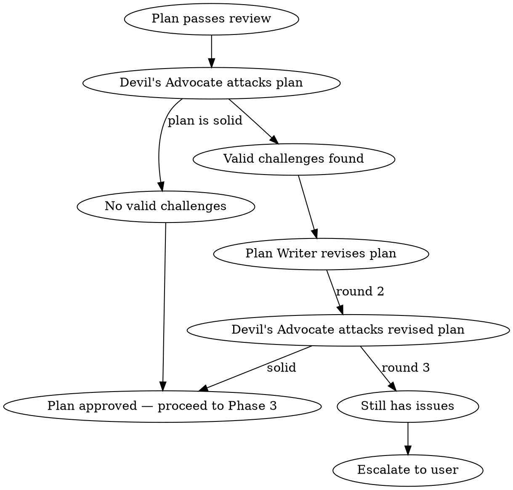
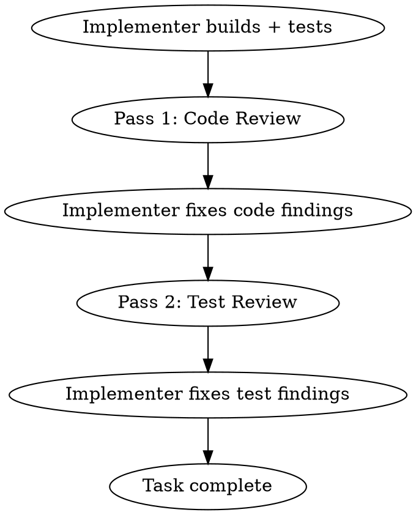

# Build

## Overview

End-to-end development pipeline: interactive brainstorming, autonomous planning with adversarial review, team-based execution with per-task code and test review. One command, idea to completion.

**Announce at start:** "I'm using the build skill to run the full development pipeline."

**Guiding principle:** Quality over velocity. This pipeline produces correct, well-integrated, maintainable output — even if slower. Parallel execution is available for independent work, but sequential with quality gates is the default.

## Phase 1: Brainstorm (Interactive)

- **Model:** Opus (creative/architectural work needs the best model)
- **Mode:** Interactive with the user
- **REQUIRED SUB-SKILL:** Use crucible:brainstorming
- Follow brainstorming skill for design refinement, section-by-section validation, and saving the design doc
- **OVERRIDE:** When brainstorming completes and the design doc is saved, do NOT follow brainstorming's "Implementation" section (do not chain into writing-plans or using-git-worktrees from there). Return control to this build skill — Phase 2 handles planning with its own subagent-based approach.
- Phase ends when user approves the design (says "go", "looks good", "proceed", etc.)
- **Everything after this point is autonomous** — tell the user: "Design approved. Starting autonomous pipeline — I'll only interrupt for escalations."

## Phase 2: Plan (Autonomous)

### Step 1: Write the Plan

Dispatch a **Plan Writer** subagent (Opus):

- Read the design doc produced in Phase 1
- Write an implementation plan following the `crucible:writing-plans` format
- Include per-task metadata: Files (with count), Complexity (Low/Medium/High), Dependencies
- Save to `docs/plans/YYYY-MM-DD-<topic>-implementation-plan.md`
- Plan tasks should be scoped to 2-3 per subagent, ~10 files max (context budget awareness)

Use `./plan-writer-prompt.md` template for the dispatch prompt.

### Step 2: Review the Plan

Dispatch a **Plan Reviewer** subagent:

Reviewer model selection:
- Plan touches **4+ systems** or has **10+ tasks** → Opus
- Plan touches **1-3 systems** with **<10 tasks** → Sonnet
- When in doubt → Opus

Review protocol:
- Round 1: Plan Reviewer checks plan against design doc
- If issues: dispatch Plan Writer to revise → Plan Reviewer re-checks (Round 2)
- Still failing after Round 2 → **escalate to user** with specific findings
- **Architectural concerns bypass the loop** — immediate escalation regardless of round

Use `./plan-reviewer-prompt.md` template for the dispatch prompt.

### Step 3: Red Team the Plan

**After the plan passes review**, dispatch a **Devil's Advocate** subagent (Opus):

The Devil's Advocate's sole job is to **attack the plan**. They are not checking boxes — they are actively trying to break it. They look for:
- Fatal flaws the reviewer missed
- Better alternative approaches the plan didn't consider
- Hidden integration risks, race conditions, or ordering problems
- Assumptions that seem reasonable but are wrong
- Scalability or maintainability traps
- Cases where the plan will technically work but produce a fragile or over-engineered result

Use `./red-team-prompt.md` template for the dispatch prompt.

**Red Team protocol:**



- Devil's Advocate must **classify each challenge** as:
  - **Fatal:** Plan will fail or produce broken output. Must be addressed.
  - **Significant:** Plan will work but has a meaningful risk or missed opportunity. Should be addressed.
  - **Minor:** Nitpick or preference. Log it but don't block.
- Only **Fatal** and **Significant** challenges trigger a revision round
- Plan Writer must **respond to each challenge** — either revise the plan or defend the current approach with a concrete argument (not hand-waving)
- If the Devil's Advocate concedes or only has Minor challenges remaining → **plan is approved**
- Maximum **3 total rounds** (initial attack + 2 revision rounds). Still contested after 3 → **escalate to user** with the full debate
- **Architectural concerns → immediate escalation** regardless of round

**What the Devil's Advocate is NOT:**
- A second Plan Reviewer (don't re-check formatting, metadata, or completeness — that's already done)
- A blocker for the sake of blocking — challenges must be specific and actionable
- A rewriter — they challenge, they don't produce an alternative plan

## Phase 3: Execute (Autonomous, Team-Based)

### Step 1: Create Team and Task List

Create a team using `TeamCreate`:
```
team_name: "build-<feature-name>"
description: "Building <feature description>"
```

Read the approved plan. Create tasks via `TaskCreate` for each plan task, including:
- Subject from plan task title
- Description with full plan task text (subagents should never read the plan file)
- Dependencies via `TaskUpdate` with `addBlockedBy`

### Step 2: Analyze Dependencies and Execution Order

Before dispatching:
1. Map the dependency graph from plan task metadata
2. Identify independent tasks (no shared files, no sequential dependencies)
3. Group into execution waves — independent tasks parallel, dependent tasks sequential
4. Assess complexity per task for reviewer model selection

### Step 3: Execute Tasks

For each task (or wave of parallel tasks):

1. Mark task `in_progress` via `TaskUpdate`
2. Spawn **Implementer** teammate (Opus) via Task tool with `team_name` and `subagent_type="general-purpose"`
   - Use `./build-implementer-prompt.md` template
   - Pass full task text, file paths, project conventions
   - Implementer follows TDD, writes tests, runs tests, commits, self-reviews
3. When Implementer reports completion, spawn **Reviewer** teammate
   - Use `./build-reviewer-prompt.md` template

#### Reviewer Model Selection (Lead Decides Per-Task)

| Task Complexity | Reviewer Model |
|----------------|----------------|
| Low (1-3 files, straightforward) | Sonnet |
| Medium (3-6 files, some cross-system) | Lead decides (default Opus) |
| High (6+ files, refactoring, deep chains) | Opus |
| When in doubt | Opus |

#### Two-Pass Review Cycle

Each task gets TWO review passes before completion:



**Pass 1 — Code Review:** Architecture, patterns, correctness, wiring (actually connected, not just existing?)

**Pass 2 — Test Review:** Stale tests? Missing coverage? Tests need updating? Dead tests to delete? Edge cases untested?

#### Revision Cap

- Maximum **2 rounds** across combined code + test review
- Still not clean after 2 → **escalate to user**
- Architectural concerns → **immediate escalation**

#### Verification Gates

After each wave completes:
1. Run full test suite (not just current wave's tests)
2. Check compilation
3. Failures → identify which task caused regression before fixing
4. Clean → proceed to next wave

#### Architectural Checkpoint

For plans with 10+ tasks, at ~50% completion or after a major subsystem:
- Dispatch architecture reviewer using `./architecture-reviewer-prompt.md`
- Design drift → escalate to user
- Minor concerns → adjust prompts for remaining tasks
- All clear → continue

## Phase 4: Completion

After all tasks complete:
1. Run full test suite
2. Compile summary: what was built, tests passing, review findings addressed, concerns
3. Report to user
4. **REQUIRED SUB-SKILL:** Use crucible:finishing-a-development-branch

## Escalation Triggers (Any Phase)

**STOP and ask the user when:**
- Architectural concerns in plan or code review
- 2 failed revision rounds (plan or code)
- Red team challenges unresolved after 3 rounds
- Test suite failures not obviously fixable
- Multiple teammates fail on different tasks
- Teammate reports context pressure at 50%+ with significant work remaining

**Minor issues:** Log, work around, include in final report.

## What the Lead Should NOT Do

- Implement code (dispatch implementers)
- Read large files (spawn Haiku researcher)
- Debug failing tests (dispatch implementer)
- Make architectural decisions (escalate to user)

## Context Management

- **One task per agent** — always spawn a fresh implementer for each task. Never send a second task to a running agent via SendMessage. Reusing agents accumulates context and causes exhaustion.
- "2-3 per subagent, ~10 files max" refers to **plan design** — group small steps into one task at planning time, not sequential dispatch to a running agent
- Lead stays thin — coordination only
- All important state on disk (plan files, task list)
- Teammates report at 50%+ context usage
- Lead compaction acceptable — task list is source of truth

## Prompt Templates

- `./plan-writer-prompt.md` — Phase 2 plan writer dispatch
- `./plan-reviewer-prompt.md` — Phase 2 plan reviewer dispatch
- `./red-team-prompt.md` — Phase 2 devil's advocate dispatch
- `./build-implementer-prompt.md` — Phase 3 implementer dispatch
- `./build-reviewer-prompt.md` — Phase 3 reviewer dispatch
- `./architecture-reviewer-prompt.md` — Mid-plan checkpoint (reused)

## Integration

**Required sub-skills:**
- **crucible:brainstorming** — Phase 1
- **crucible:finishing-a-development-branch** — Phase 4

**Implementer sub-skills:**
- **crucible:test-driven-development** — TDD within each task
