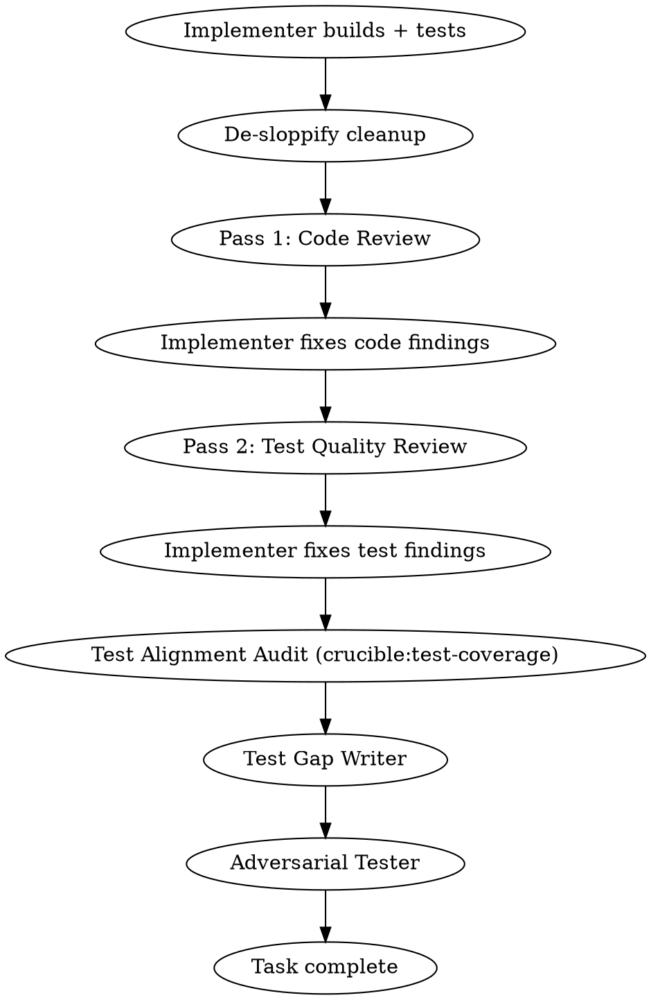

# Build

## Overview

End-to-end development pipeline: interactive design, autonomous planning with adversarial review, team-based execution with per-task code and test review. One command, idea to completion.

**Announce at start:** "I'm using the build skill to run the full development pipeline."

**Guiding principle:** Quality over velocity. This pipeline produces correct, well-integrated, maintainable output — even if slower. Parallel execution is available for independent work, but sequential with quality gates is the default.

## Communication Requirement (Non-Negotiable)

**Between every agent dispatch and every agent completion, output a status update to the user.** This is NOT optional — the user cannot see agent activity without your narration.

Every status update must include:
1. **Current phase** — Which pipeline phase you're in
2. **What just completed** — What the last agent reported
3. **What's being dispatched next** — What you're about to do and why
4. **Task checklist** — Current status of all tasks (pending/in-progress/complete)

**After compaction:** If you just experienced context compaction, re-read the task list from disk and output current status before continuing. Do NOT proceed silently.

**Examples of GOOD narration:**
> "Phase 3, Task 4 complete. Reviewer found 2 Important issues — dispatching implementer to fix. Tasks: [1] ✓ [2] ✓ [3] ✓ [4] fixing [5-8] pending"

> "Phase 2 complete. Plan passed review with 0 issues on round 2. Dispatching innovate on the plan."

**This requirement exists because:** Long-running autonomous pipelines can run for hours. Without narration, the user sees nothing but a spinner. They can't assess progress, can't decide whether to intervene, and can't learn from the pipeline's decisions.

## Quality Gate Requirement (Non-Negotiable)

**Every quality gate in this pipeline MUST run to completion.** This is NOT optional — you may NOT self-assess whether a quality gate is "needed" based on task size, complexity, or scope.

Quality gates are unconditional at all three gate points:
1. **Phase 1, Step 2** — Design doc gate
2. **Phase 2, Step 3** — Plan gate
3. **Phase 4, Step 6** — Implementation gate

**Common rationalizations that are NEVER valid reasons to skip:**
- "This is a small change"
- "This is trivial / simple / straightforward"
- "This is just a config change / documentation update / one-liner"
- "The quality gate won't find anything on something this simple"
- "I fixed the findings, so the gate is done" — **fixing findings is NOT the same as passing the gate.** The iteration loop must complete with a clean verification round (0 Fatal, 0 Significant on a fresh review). Fix agents introduce new issues or incompletely resolve old ones — that is why fresh-eyes re-review exists.

**This requirement exists because:** Quality gates consistently find issues the pipeline misses regardless of task size. There is no category of task that is immune. In observed runs, tasks self-assessed as "trivial" had the same defect rate as complex tasks. The only way to skip a quality gate is with explicit user approval — an unambiguous instruction specifically referencing the gate, not general feedback like "looks good" or "move on."

## Pipeline Status

Write a status file to `~/.claude/projects/<hash>/memory/pipeline-status.md` at every narration point. This file is overwritten (not appended) and provides ambient awareness for the user in a second terminal.

### Write Triggers

Write the status file at every point where the Communication Requirement mandates narration: before dispatch, after completion, phase transitions, health changes, escalations, and after compaction recovery.

### Status File Format

The status file uses this structure (overwritten in full each time):

```
# Pipeline Status
**Updated:** <current timestamp>
**Started:** <timestamp from first write — persisted across compaction>
**Skill:** build
**Phase:** <current phase, e.g. "3 — Execute (Autonomous)">
**Health:** <GREEN|YELLOW|RED>
**Suggested Action:** <omit when GREEN; concrete one-sentence action when YELLOW/RED>
**Elapsed:** <computed from Started>

## Recent Events
- [HH:MM] <most recent event>
- [HH:MM] <previous event>
(last 5 events, newest first)
```

### Skill-Specific Body

Append after the shared header:

```
## Task Progress
| # | Task | Tier | Status | Duration |
|---|------|------|--------|----------|
| 1 | Auth middleware | T3 | DONE | 12m |
| 2 | Route handlers | T2 | IN REVIEW (code, pass 1) | 18m+ |
| 3 | Database layer | T1 | PENDING | — |

## Quality Gates
- Design: PASSED (2 rounds)
- Plan: PASSED (1 round)
- Task tiers: 1x T1, 1x T2, 1x T3
- Code: not yet reached

## Checkpoints
- Last checkpoint: pre-wave-3 (12:45:30)
- Total checkpoints: 7
- Shadow repo: healthy

## Compression State
Goal: [original user request]
Key Decisions:
- [accumulated decisions, max 10]
Active Constraints:
- [constraints affecting remaining work]
Next Steps:
1. [immediate next action]
2. [subsequent actions]
```

The Compression State section is a semantic subset of the full Compression State Block emitted into the conversation. It omits Files Modified (recoverable from git) and Scratch State (fixed per skill). It is the first section read during compaction recovery.

### Health State Machine

Health transitions are one-directional within a phase: GREEN -> YELLOW -> RED. Phase boundaries reset to GREEN.

- **Phase boundaries** (reset to GREEN): Phase 1->2, 2->3, 3->4
- **YELLOW:** review loop round 3+, quality gate round 5+, retry in progress
- **RED:** escalation pending, stagnation detected, test suite failure unresolved

When health is YELLOW or RED, include `**Suggested Action:**` with a concrete, context-specific sentence (e.g., "Code review looping on Task 4. Check recent events for recurring patterns.").

### Inline CLI Format

Output concise inline status alongside the status file write:
- **Minor transitions** (dispatch, completion): one-liner, e.g. `Phase 3 [4/8] Task 4 IN REVIEW (pass 1) | GREEN | 1h 12m`
- **Phase changes and escalations**: expanded block with `---` separators
- **Health transitions**: always expanded with old -> new health

### Compaction Recovery

After compaction, before re-writing the status file:
0. Read the `## Compression State` section from `pipeline-status.md` — recover Goal, Key Decisions, Active Constraints, and Next Steps. If the section is absent (pre-update pipeline), skip to step 1.
0.5. Check for handoff manifests (`handoff-*-to-*.md`) in the scratch directory. If the most recent manifest exists, use its Inputs, Decisions, and Constraints to reconstruct state for the current phase — this supersedes the Compression State section for phase-boundary recovery. If no manifest exists, continue with CSB-based recovery.
1. Read the rest of `pipeline-status.md` to recover `Started` timestamp and `Recent Events` buffer
2. Reconstruct phase, health, and skill-specific body from internal state files
3. If crucible:checkpoint was used: verify checkpoint availability by checking for the shadow repo at the computed path. Log available checkpoint count. Do not restore — just confirm checkpoints are recoverable.
4. Emit a Compression State Block into the conversation to seed the new context window with recovered state
5. Write the updated status file
6. Output inline status to CLI

### Compression State Block

At checkpoint boundaries (see Checkpoint Timing below), emit the following structured block into the conversation. This block signals to the auto-compactor which state is critical to preserve. Also persist the semantic subset (Goal, Key Decisions, Active Constraints, Next Steps) to the `## Compression State` section of pipeline-status.md.

```
===COMPRESSION_STATE===
Goal: [original user request, one sentence]
Skill: [skill name]
Phase: [current phase identifier]
Health: [GREEN|YELLOW|RED]
Mode: [skill-specific mode if applicable, omit otherwise]

Progress:
- [completed milestone 1]
- [completed milestone 2]
- [current work in progress]

Key Decisions (this session):
- [DEC-1] [decision]: [reasoning, one line]
- [DEC-2] [decision]: [reasoning, one line]

Active Constraints:
- [constraint that affects remaining work]
- [constraint from prior phase that still applies]

Files Modified:
- [file path]: [what changed, one line]

Scratch State:
- Location: [scratch directory path]
- Recovery: [which files to read first, in order]

Next Steps:
1. [immediate next action]
2. [action after that]
3. [remaining work summary]
===END_COMPRESSION_STATE===
```

**Rules:**
- Key Decisions list is capped at 10. When adding an 11th, compress the oldest low-impact decision into a single-line Progress entry annotated "[compressed from decisions]".
- Each Compression State Block includes the FULL accumulated decision list, not just new decisions since the last block. Decisions accumulate across compressions.
- Progress entries are cumulative — include all completed milestones, not just since the last block.
- Files Modified lists only files changed since the last block emission. On first block of a session, list all files changed so far.
- Goal must be the original user request verbatim or a faithful one-sentence paraphrase. Do not let it drift across compressions.

### Checkpoint Timing

Emit a Compression State Block into the conversation AND update the `## Compression State` section in pipeline-status.md at these points:

- **Phase transitions:** 1→2, 2→3, 3→4 — emit a **Phase Handoff Manifest** (see below) instead of a Compression State Block at these points
- **Phase 3 progress:** After every 3 task completions
- **Quality gate entry/exit:** Before first quality gate round dispatch and after gate completes (pass or escalation)
- **Escalations:** Before any escalation to user
- **Health transitions:** On any GREEN->YELLOW or YELLOW->RED transition

These triggers are a superset of the existing pipeline-status.md write triggers. The Compression State Block is emitted alongside (not instead of) the normal narration and status file write.

### Phase Handoff Manifest

At phase boundaries (1→2, 2→3, 3→4), write a **handoff manifest** to the scratch directory instead of emitting a Compression State Block. The manifest defines exactly what the next phase needs — an allowlist, not a denylist. Everything not on the manifest is shed.

**Format:**

```markdown
# Phase Handoff: N → M
**Timestamp:** ISO-8601
**Goal:** [original user request, verbatim]
**Mode:** feature | refactor

## Inputs for Phase M
- **[Input name]:** [disk path or inline value]

## Decisions Carried Forward
- [DEC-N] [decision]: [reasoning, one line]

## Active Constraints
- [constraint affecting remaining work]

## Shed Receipt
- [what was shed] → [where it lives on disk]
```

**Rules:**
- After writing the manifest, emit an explicit **shed statement**: list what context is no longer needed, where it lives on disk, and that the orchestrator operates from manifest inputs only going forward.
- After writing the manifest, update the `## Compression State` section in pipeline-status.md with the manifest contents (Goal, Decisions, Constraints, and the Inputs as Next Steps). This ensures compaction recovery can reconstruct state even if the manifest is lost.
- CSBs continue at all non-boundary checkpoint triggers (intra-phase progress, quality gate entry/exit, escalations, health transitions).
- **Backward compatibility:** If a handoff manifest does not exist at a recovery point, fall back to CSB-based recovery (existing behavior).

## Mode Detection

Before dispatching the design skill, determine whether this build is:

- **Feature mode** (default) — adding new capability. Success = new acceptance tests pass.
- **Refactor mode** — restructuring existing code. Success = existing behavior preserved + structural goals met.

**Detection:** If the user's intent is ambiguous, ask directly before proceeding:

> "Is this adding new behavior, or restructuring existing code without changing what it does?"

The user's answer sets the mode for the entire pipeline. No special syntax needed.

### Mode Propagation

Propagate refactor mode to subagents through:

1. **New refactor-specific prompt templates** — `contract-test-writer-prompt.md` and `refactor-implementer-addendum.md` are standalone files used only in refactor mode. Select these instead of (or in addition to) the feature-mode equivalents.
2. **Appended context blocks** — For existing prompts that serve both modes (`plan-writer-prompt.md`, `build-implementer-prompt.md`), append a "Refactor Mode Context" section when pasting the prompt. The templates remain flat markdown — the orchestrator decides what to paste.
3. **Scratch file for compaction recovery** — Persist the current mode in `/tmp/crucible-build-mode.md` containing `mode: refactor` or `mode: feature` plus the baseline commit SHA. Only one build runs per session, so a well-known filename is sufficient.

### Compaction Recovery

Build's existing compaction step must read the Compression State FIRST (step 0 from Pipeline Status Compaction Recovery), then the mode file, before re-reading the task list or any other state. On resumption after compaction:

0. **Read `## Compression State` from pipeline-status.md** — recover goal, decisions, constraints, next steps.
0.5. **Check for handoff manifests** (`handoff-*-to-*.md`) in the scratch directory. If the most recent manifest exists, use its Inputs and Mode to bootstrap recovery — this supersedes the mode file for phase-boundary state.
1. **Read `/tmp/crucible-build-mode.md`** — recover mode and baseline commit SHA.
2. **If file is missing:** Default to feature mode and warn.
3. **If mode is `refactor`:** Verify baseline commit SHA exists.
4. **After mode is recovered:** Proceed with general state reconstruction (task list, phase, health).

## Phase 1: Design (Interactive)

### Step 0: Pre-Existing Doc Detection

Before running interactive design, check whether `/spec` (or a prior `/build` run) already produced design artifacts for this ticket.

1. **Scan for pre-existing spec docs:** Search `docs/plans/` for design docs (`*-design.md`) with a matching `ticket` field in YAML frontmatter. Also check for corresponding `*-implementation-plan.md` and `*-contract.yaml` files with the same ticket field.

2. **Conflict detection:** If multiple design docs match the same `ticket` field, escalate to user: "Found multiple design docs for ticket #NNN: [list files]. Which should I use?" Do not proceed until the user resolves the conflict.

3. **Full match (design doc + implementation plan + contract all present):**
   - Skip interactive design (the Phase 1 design sub-skill below) — design doc already exists
   - Quality-gate the existing design doc with staleness context: "This design doc is pre-existing from /spec and may be stale — verify against current codebase state before proceeding"
   - **Staleness rejection:** If the quality gate finds that the design doc references files, interfaces, or modules that no longer exist in the codebase, reject the doc as fundamentally stale. Fall back to running Phase 1 interactively. Inform user: "Pre-existing design doc for #NNN is fundamentally stale (references [specific items] that no longer exist). Running interactive design instead."
   - If quality gate passes: Run Phase 2 on the pre-existing implementation plan — skip Plan Writer (plan already exists), but run Plan Reviewer + innovate + quality-gate on the existing plan. This ensures the plan gets the same review rigor as a freshly written plan.
   - If quality gate fails (non-staleness issues): fix or escalate
   - Proceed to Phase 3 when the plan passes review

4. **Partial match (design doc present but implementation plan or contract missing):**
   - Use the existing design doc (quality-gate it as above, including staleness rejection)
   - Run the missing phases normally: if no implementation plan, run Plan Writer in Phase 2; if no contract, proceed without contract awareness for this ticket
   - Inform user which artifacts were found and which are being generated fresh: "Found pre-existing design doc for #NNN. Implementation plan is missing — will generate in Phase 2." (or similar)

5. **Not found:** Proceed with normal Phase 1 (interactive design below).

---

- **Model:** Opus (creative/architectural work needs the best model)
- **Mode:** Interactive with the user
- **RECOMMENDED SUB-SKILL:** Use crucible:forge (feed-forward mode) — consult past lessons before starting
- **RECOMMENDED SUB-SKILL:** Use crucible:cartographer (consult mode) — review codebase map for structural awareness
- **REQUIRED SUB-SKILL:** Use crucible:design
- Follow design skill for design refinement, section-by-section validation, and saving the design doc
- **OVERRIDE:** When design completes and the design doc is saved, do NOT follow design's "Implementation" section (do not chain into planning or worktree from there). Return control to this build skill — Phase 2 handles planning with its own subagent-based approach.
- Phase ends when user approves the design (says "go", "looks good", "proceed", etc.)
- **Everything after this point is autonomous** — tell the user: "Design approved. Starting autonomous pipeline — I'll only interrupt for escalations."

### Step 2: Innovate and Red-Team the Design

After the user approves the design and before starting Phase 2:

**RECOMMENDED SUB-SKILL:** Use crucible:checkpoint — create checkpoint with reason "pre-design-gate" before dispatching innovate and quality-gate on the design doc.

1. **Innovate:** Dispatch `crucible:innovate` on the design doc. Plan Writer incorporates the proposal.
2. **REQUIRED SUB-SKILL:** Use crucible:quality-gate on the (potentially updated) design doc with artifact type "design". Iterates until clean or stagnation. **(Non-negotiable — see Quality Gate Requirement.)**
3. If the quality gate requires changes, the Plan Writer updates the design doc and re-commits.
4. Design doc is now finalized — proceed to acceptance tests.

### Step 2.5: Generate PRD

After the design doc is finalized (Step 2 complete), generate a stakeholder-facing PRD:

1. Dispatch a **PRD Writer** subagent (Sonnet) using `./prd-writer-prompt.md`
   - Input: finalized design doc
   - Output: PRD in standard format (problem statement, user stories, requirements, scope, out-of-scope, success metrics, technical notes, dependencies)
2. Save to `docs/prds/YYYY-MM-DD-<topic>-prd.md`
3. Commit: `docs: add PRD for [feature]`

This step runs by default. The PRD is a reformatting of the design doc for non-technical stakeholders — it does not introduce new decisions or requirements. Skip only in refactor mode (refactoring has no stakeholder-facing PRD).

### Step 3: Generate Acceptance Tests (RED)

Before planning, define "done" with executable tests:

1. Dispatch an **Acceptance Test Writer** subagent (Opus) using `./acceptance-test-writer-prompt.md`
   - Input: finalized design doc (especially acceptance criteria)
   - Output: integration-level test file(s) that verify feature behavior end-to-end
2. Run the acceptance tests — verify they **FAIL** (the feature doesn't exist yet)
   - If tests pass: something is wrong — investigate before proceeding
   - If tests error (won't compile): this is expected in typed languages — note which tests exist and what they verify. They become the first implementation task.
3. Commit: `test: add acceptance tests for [feature] (RED)`

These tests define the feature-level RED-GREEN cycle that wraps the entire pipeline. The pipeline is done when these tests pass.

### Refactor Mode: Phase 1 Changes

When in refactor mode, Phase 1 shifts from "what should we build?" to "what are we changing and what could break?"

#### Blast Radius Analysis

After the user describes the refactoring intent, the design phase:

1. **Identify the target** — What code is being restructured? (module, interface, data representation, file organization, etc.)
2. **Trace the blast radius** using cartographer (if available) or fallback exploration:
   - **Direct consumers** — code that imports/calls/references the target
   - **Indirect dependents** — code that depends on consumers (transitive)
   - **Test coverage** — which tests exercise the target behavior
   - **Configuration/wiring** — DI registrations, config files, build scripts that reference the target
   - **Fallback when cartographer is unavailable:** Use language-aware symbol search via agent exploration. Grep for symbol references (imports, type annotations, function calls) using language-specific patterns. The impact manifest's confidence field reflects reduced precision.
3. **Present an impact manifest** to the user:

```
### Impact Manifest

**Target:** [what's being restructured]
**Structural goal:** [what the code should look like after]

**Direct consumers:** N files
- path/to/consumer1.py (calls TargetClass.method)
- path/to/consumer2.py (imports TargetClass)

**Indirect dependents:** N files
- path/to/dependent.py (depends on consumer1)

**Test coverage:**
- N tests directly exercise target behavior
- N tests exercise consumers
- Gap: no tests cover [specific seam]

**Risk assessment:** [Low/Medium/High] based on consumer count and coverage gaps
**Confidence:** [High/Medium/Low] — High if cartographer used, Medium/Low if fallback
```

**When confidence is Low**, require explicit user confirmation before proceeding. The user must review the impact manifest and confirm the blast radius is complete.

4. **Design the structural goal** — what should the code look like after the refactoring? User validates the target state.

#### Acceptance Tests (Refactor Mode)

Instead of writing NEW acceptance tests (Step 3 above), the pipeline:

1. **Dispatch the contract test writer** using `./contract-test-writer-prompt.md` — a single agent handles gap identification AND gap filling. Input: impact manifest + blast radius file list. The agent maps existing tests to behavioral seams, identifies untested seams, and writes contract tests for each gap.
2. **Run all contract tests GREEN** — contract tests must pass before any refactoring begins.
3. **If a contract test FAILS:** The contract test writer investigates:
   - **Test defect** (wrong assertion, bad setup) — fix the test and re-run
   - **Latent codebase bug** — report to user with options: (a) fix the bug first, (b) exclude this seam and accept the risk, (c) abort the refactoring. Never silently drop a failing contract test.
4. **Commit:** `test: add contract tests for [target] refactoring (GREEN — locking existing behavior)`

#### Proportionality Escape Valve

Contract test writing must remain proportional to the refactoring scope. Trigger a scope check when **any** of these thresholds are hit:

- **Count threshold:** More than 15 contract tests needed
- **Effort threshold:** Contract test writer reports context pressure, or estimated total contract test LOC exceeds ~2x the estimated refactoring scope LOC

When triggered:
1. Present the full gap list to the user with estimated effort per gap
2. User selects which gaps to fill and which to accept as uncovered risk
3. Proceed with only user-selected contract tests

The impact manifest records which gaps the user chose to leave uncovered.

### Phase Handoff: 1 → 2

Before dispatching the Plan Writer, write a handoff manifest to the scratch directory:

1. Write `handoff-1-to-2.md` with:
   - **Goal:** original user request, verbatim
   - **Mode:** feature or refactor
   - **Inputs for Phase 2:** design doc path, acceptance test paths (or contract tests in refactor mode), PRD path (if generated), conventions path (from cartographer, if loaded)
   - **Decisions Carried Forward:** accumulated decisions from Phase 1
   - **Active Constraints:** constraints affecting planning
   - **Shed Receipt:** design iteration history, innovate proposals, quality gate round details → design doc on disk captures the outcome
2. Emit shed statement: "Phase 1 context shed. Design doc, acceptance tests, and PRD are on disk. Design iteration history, innovate proposals, and gate round details are not carried forward."
3. Update `## Compression State` in pipeline-status.md with manifest contents.
4. Do NOT emit a Compression State Block (manifest replaces it at this boundary).

## Phase 2: Plan (Autonomous)

### Step 1: Write the Plan

Dispatch a **Plan Writer** subagent (Opus):

- Read the design doc produced in Phase 1 and the acceptance tests from Step 3
- Write an implementation plan following the `crucible:planning` format
- If acceptance tests couldn't compile (typed language), Task 1 should create the interfaces/stubs needed for them to compile and fail correctly
- Include per-task metadata: Files (with count), Complexity (Low/Medium/High), Dependencies
- Save to `docs/plans/YYYY-MM-DD-<topic>-implementation-plan.md`
- Plan tasks should be scoped to 2-3 per subagent, ~10 files max (context budget awareness)

Use `./plan-writer-prompt.md` template for the dispatch prompt.

### Step 2: Review the Plan

Dispatch a **Plan Reviewer** subagent:

Reviewer model selection:
- Plan touches **4+ systems** or has **10+ tasks** → Opus
- Plan touches **1-3 systems** with **<10 tasks** → Sonnet
- When in doubt → Opus

Review protocol (iterative):
- Dispatch Plan Reviewer to check plan against design doc
- If issues found: record issue count, dispatch Plan Writer to revise
- Dispatch NEW fresh Plan Reviewer on revised plan (no anchoring)
- Compare issue count to prior round:
  - Strictly fewer issues → progress, loop again
  - Same or more issues → stagnation, **escalate to user** with findings from both rounds
- Loop until plan passes with no issues
- **Architectural concerns bypass the loop** — immediate escalation regardless of round

Use `./plan-reviewer-prompt.md` template for the dispatch prompt.

### Step 3: Innovate and Red-Team the Plan

**After the plan passes review:**

**RECOMMENDED SUB-SKILL:** Use crucible:checkpoint — create checkpoint with reason "pre-plan-gate" before dispatching innovate and quality-gate on the plan.

1. **Innovate:** Dispatch `crucible:innovate` on the approved plan. Plan Writer incorporates the proposal into the plan.
2. **REQUIRED SUB-SKILL:** Use crucible:quality-gate on the (potentially updated) plan with artifact type "plan". Provides the plan and design doc as context. **(Non-negotiable — see Quality Gate Requirement.)**

The quality gate handles the iterative red-team loop — fresh review each round, weighted stagnation detection, 15-round safety limit, escalation. See `crucible:quality-gate` for details.

### Phase Handoff: 2 → 3

Before creating the team and task list, write a handoff manifest:

1. Write `handoff-2-to-3.md` with:
   - **Goal:** original user request, verbatim
   - **Mode:** feature or refactor
   - **Inputs for Phase 3:** plan path, design doc path, acceptance test paths (or contract tests), contract YAML path (if exists), baseline SHA (current HEAD), cartographer context paths (module files, conventions.md, landmines.md)
   - **Decisions Carried Forward:** accumulated decisions from Phases 1-2
   - **Active Constraints:** constraints affecting execution
   - **Shed Receipt:** plan review iterations, innovate proposals, quality gate round history → plan on disk captures the outcome
2. Emit shed statement: "Phase 2 context shed. Plan, design doc, and acceptance tests are on disk. Plan review rounds, innovate proposals, and gate details are not carried forward."
3. Update `## Compression State` in pipeline-status.md with manifest contents.
4. Do NOT emit a Compression State Block.

## Phase 3: Execute (Autonomous, Team-Based)

### Step 0: Load Module Context for Subagents

- **RECOMMENDED SUB-SKILL:** Use crucible:cartographer (load mode) — when dispatching implementers and reviewers, paste relevant module files, conventions.md, and landmines.md into their prompts

- **Defect signature loading (for implementers only):**
  1. Glob `defect-signatures/*.md` (excluding `*.non-matches.md`) from the cartographer storage directory
  2. For each signature, read its `Modules` field and match against the task's target modules:
     - Read each cartographer module file's `Path:` field
     - A task's file is in a module if the file path starts with the module's `Path:` value
     - When a task spans multiple modules, load signatures for all matched modules
     - **Directory prefix fallback:** When no cartographer modules exist, match if any target file path starts with any of the signature's `Modules` directory prefixes
  3. For matching signatures, validate all file paths still exist on disk — drop stale entries silently
  4. Inject into the `[DEFECT_SIGNATURES]` section of `build-implementer-prompt.md`:
     - Generalized pattern (always)
     - Confirmed siblings list (always)
     - Unresolved siblings list (always — these are known live defects; produces a stronger warning)
     - Non-match companion files are NOT loaded for implementers
  5. **`Last loaded` update:** Loading is pure-read. After all implementer dispatches for the current phase complete, batch-update the `Last loaded` field to today on all signatures that were loaded. Do NOT update during dispatch — defer to after all subagents are dispatched.

### Step 1: Create Team and Task List

Create a team using `TeamCreate`:
```
team_name: "build-<feature-name>"
description: "Building <feature description>"
```

Read the approved plan. Create tasks via `TaskCreate` for each plan task, including:
- Subject from plan task title
- Description with full plan task text (subagents should never read the plan file)
- Dependencies via `TaskUpdate` with `addBlockedBy`

#### Agent Teams Fallback

If `TeamCreate` fails (agent teams not available), output a clear one-time warning:

> ⚠️ Agent teams are not available. Recommended: set `CLAUDE_CODE_EXPERIMENTAL_AGENT_TEAMS=1`
> Falling back to sequential subagent dispatch via Agent tool.

Then fall back to sequential subagent dispatch via the regular Task tool (without `team_name`). Everything still works — independent tasks run sequentially instead of in parallel via teammates.

**What changes in fallback mode:**
- Tasks are dispatched via `Agent` tool instead of as teammates
- Independent tasks that would run in parallel now run sequentially
- Task tracking still uses `TaskCreate`/`TaskUpdate` for state management
- All other pipeline behavior (TDD, review, de-sloppify, quality gates) is unchanged

### Step 2: Analyze Dependencies and Execution Order

Before dispatching:
1. Map the dependency graph from plan task metadata
2. Identify independent tasks (no shared files, no sequential dependencies)
3. Group into execution waves — independent tasks parallel, dependent tasks sequential
4. Assess complexity per task for reviewer model selection

### Step 3: Execute Tasks

For each task (or wave of parallel tasks):

**RECOMMENDED SUB-SKILL:** Before dispatching each execution wave, use crucible:checkpoint — create checkpoint with reason "pre-wave-N" (where N is the wave number). This captures the working directory state after the prior wave's verification gate passed.

1. Mark task `in_progress` via `TaskUpdate`
2. Spawn **Implementer** teammate (Opus) via Task tool with `team_name` and `subagent_type="general-purpose"`
   - Use `./build-implementer-prompt.md` template
   - Pass full task text, file paths, project conventions
   - **Contract-aware dispatch (when a contract exists for this ticket):** Include the contract YAML alongside the design doc and task description. See "Contract-Aware Implementer Guidance" below.
   - Implementer follows TDD, writes tests, runs tests, commits, self-reviews
3. When Implementer reports completion, run **De-Sloppify Cleanup** (see below)
4. After cleanup completes, spawn **Reviewer** teammate
   - Use `./build-reviewer-prompt.md` template
5. **Tier-aware review routing:** Read the task's `Review-Tier` from plan metadata.
   - **Tier 1:** Dispatch single-pass code reviewer (Sonnet). If Clean or Minor-only: task complete. If Critical/Important: dispatch implementer fix, then task complete. If Architectural Concern: escalate.
   - **Tier 2:** Dispatch iterative code review (per existing loop). Then dispatch single-pass test reviewer. If test review surfaces Critical findings, escalate to Tier 3. Then dispatch adversarial tester (per existing logic). Task complete.
   - **Tier 3:** Follow current full pipeline (no changes to existing flow).

#### Contract-Aware Implementer Guidance

When a contract YAML exists for the current ticket (detected during Step 0 or produced by `/spec`), the implementer receives the contract alongside the design doc and task description. The contract uses the schema defined in `crucible:spec` (version `1.0`). Implementers must treat contract elements as follows:

1. **`api_surface` declarations are binding.** The implementer must match the declared function signatures, class interfaces, endpoint shapes, parameter names, types, and return types exactly. Deviations from the contract's API surface are implementation errors.

2. **`checkable` invariants are binding.** The implementer must satisfy all declared constraints (e.g., "must not import X", "must be idempotent"). The `check_method` field (`grep`, `code-inspection`, `file-structure`) indicates how the quality gate will verify compliance — the implementer should self-check against these before committing.

3. **`testable` invariants require tagged tests.** For each `testable` invariant, the implementer must write a test tagged with the declared `test_tag` (pattern: `contract:<category>:<id>`) that validates the invariant. These tests are checked by the quality gate and reviewers — they must exist and pass.

4. **`integration_points` are informational.** These indicate which other components and contracts this ticket interacts with. The implementer should be aware of referenced components and ensure compatibility, but integration points are not binding constraints — they provide context for making good implementation decisions.

#### De-Sloppify Cleanup

After the implementer reports completion and before dispatching the reviewer:

**RECOMMENDED:** Use crucible:checkpoint — create checkpoint with reason "pre-cleanup-task-N" before dispatching the cleanup agent. If cleanup removes something needed, restore to this checkpoint.

1. Record the pre-cleanup commit SHA
2. Dispatch a fresh **Cleanup Agent** (Opus) using `./cleanup-prompt.md`
   - Input: `git diff <pre-task-sha>..HEAD` (the implementer's committed changes)
   - The orchestrator provides the pre-task commit SHA to the cleanup agent
3. Cleanup agent reviews changes, removes unnecessary code (see allowlist), runs tests
4. If cleanup made changes, commits separately: `refactor: cleanup task N implementation`
5. If cleanup found nothing to remove, reports "No cleanup needed" and proceeds

#### Reviewer Model Selection (Lead Decides Per-Task)

| Task Complexity | Reviewer Model |
|----------------|----------------|
| Low (1-3 files, straightforward) | Sonnet |
| Medium (3-6 files, some cross-system) | Lead decides (default Opus) |
| High (6+ files, refactoring, deep chains) | Opus |
| When in doubt | Opus |

#### Two-Pass Review Cycle

Each task gets TWO review passes before completion:



**Pass 1 — Code Review:** Architecture, patterns, correctness, wiring (actually connected, not just existing?)

**Pass 2 — Test Quality Review:** Test independence? Determinism? Edge cases? Integration tests where mocks are masking real behavior? AAA pattern? Correct test level? (Staleness and alignment checks are handled by the test-coverage dispatch below.)

#### Review Tier Routing

Each task's `Review-Tier` (from the plan) determines which review steps execute. Phase 4 full-implementation gates are NOT affected by per-task tiers.

| Step | Tier 1 | Tier 2 | Tier 3 |
|------|--------|--------|--------|
| Implementer | Yes | Yes | Yes |
| De-sloppify cleanup | Yes | Yes | Yes |
| Pass 1: Code review | Single pass | Iterative | Iterative |
| Implementer fixes (code) | If findings | If findings | If findings |
| Pass 2: Test quality review | SKIP | Single pass (non-iterative) | Iterative |
| Implementer fixes (test) | SKIP | If critical findings only | If findings |
| Test alignment audit | SKIP | SKIP | Yes |
| Test gap writer | SKIP | SKIP | Yes |
| Adversarial tester | SKIP | Yes | Yes |

**Tier 1 "single pass" code review:** Dispatch one reviewer. If findings are Clean, task is complete. If findings include Critical or Important issues, dispatch implementer to fix, then the task is complete (no re-review). If findings include an Architectural Concern, escalate as normal.

**Tier 2 "single pass" test review:** Dispatch one test quality reviewer. Report findings but do NOT enter the iterative review loop. If the single pass surfaces Critical findings, escalate the task to Tier 3 for full iterative treatment.

**Tier 2 "iterative" code review:** Same as current behavior -- fresh reviewer each round, track issue count, loop until clean or stagnation.

#### Runtime Tier Escalation

The orchestrator may escalate a task's review tier during execution. Escalation is one-directional (up only).

**Triggers:**
- Implementer reports unexpected complexity or cross-system interaction not anticipated in the plan
- Single-pass reviewer (Tier 1 code review or Tier 2 test review) reports Critical findings
- Implementer touches significantly more files than the plan specified

**Process:**
1. Log escalation to decision journal: `[timestamp] DECISION: review-tier | choice=escalate T1->T2 | reason=<trigger> | alternatives=none`
2. Execute the additional review steps for the new tier (from the point where the current tier's pipeline diverges)
3. Update the task status display to show the escalated tier

#### Contract-Aware Reviewer Guidance

When a contract YAML exists for the current ticket, reviewers receive the contract alongside the implementation and must add the following checks to both review passes:

1. **API surface compliance:** Do the implemented public interfaces match the `api_surface` declarations in the contract? Check function signatures, class interfaces, endpoint shapes, parameter names/types, and return types. Any deviation from the contract's declared API surface is a blocking finding.

2. **Checkable invariant satisfaction:** Are all `checkable` invariants satisfied per their declared `check_method`?
   - `grep`: verify the pattern match (or absence) in production code
   - `code-inspection`: read and reason about code to confirm the invariant holds
   - `file-structure`: check file existence/organization matches the constraint
   Any unsatisfied checkable invariant is a blocking finding.

3. **Testable invariant test existence:** Does a test exist for each `testable` invariant, tagged with the correct `test_tag` (pattern: `contract:<category>:<id>`)? A missing tagged test is a blocking finding.

4. **Test correctness:** Do the tagged tests actually validate the invariant they claim to cover? A test that exists but does not meaningfully exercise the invariant (e.g., a trivially passing assertion, a test that tests something unrelated despite having the right tag) is a blocking finding.

**Severity:** All contract-related review findings are classified as **blocking** — the same severity as contract violations in the quality gate. Contract findings must be resolved before the task is marked complete.

#### Test Alignment Audit

After the implementer addresses Pass 2 findings, invoke `crucible:test-coverage` against the task's changes:
- Code diff: `git diff <pre-task-sha>..HEAD`
- Affected test files: test files touched or related to the task
- Context: "Build task N: [task description]"

The test-coverage skill audits existing tests for staleness (wrong assertions, misleading descriptions, dead tests, coincidence tests) and handles its own fix dispatch and revert-on-failure logic. It returns a structured report. Note: the diff includes review fix commits — the audit agent should focus on behavioral changes to source files, not changes that only touch test files.

**Skip this step if** the task made no behavioral source changes (only `.md`, `.json`, config files).

#### Test Gap Writer

After test-coverage completes (or is skipped), dispatch a **Test Gap Writer** (Opus) using `./test-gap-writer-prompt.md`:

1. Input: Pass 2 test reviewer's missing coverage findings + implementer's changes + test-coverage audit report (if available)
2. The test gap writer writes tests ONLY for gaps the reviewer identified — no scope creep. Before writing a new test for a flagged gap, verify no existing test already covers this path (it may have been updated by the test-coverage audit).
3. Tests should pass immediately (the behavior already exists from implementation)
4. The test gap writer reports per-test PASS/FAIL results (see prompt template for report format)
5. Commits new tests: `test: fill coverage gaps for task N`

**If all tests PASS:** Continue to adversarial tester.

**If some tests FAIL** (gaps reveal genuinely missing implementation):
1. Dispatch a fresh implementer (Opus) with the failing test(s), their failure messages, and the gap descriptions from the reviewer
2. Implementer fixes the missing behavior, then re-runs ALL test gap writer tests (not just the failures — catches regressions from the fix)
3. If all tests pass after fix: commit (`fix: address test gap failures for task N`), continue to adversarial tester
4. If tests still fail after one fix attempt: **escalate to user** with:
   - Which coverage gaps the reviewer identified
   - Which tests the gap writer wrote (per-test PASS/FAIL)
   - What the implementer attempted to fix
   - Which tests still fail and their current failure messages

**Skip this step if** the Pass 2 test reviewer reported zero missing coverage gaps.

#### Adversarial Tester

After the test gap writer completes (or is skipped), dispatch an **Adversarial Tester** (Opus) using `skills/adversarial-tester/break-it-prompt.md`:

1. Input: Full diff of the task's changes (`git diff <pre-task-sha>..HEAD`), project test conventions, cartographer module context (if available)
2. The adversarial tester identifies the top 5 most likely failure modes, writes one test per mode, and runs them
3. Outcome handling:
   - **All tests PASS:** Implementation is robust. Log results and proceed to task complete.
   - **Some tests FAIL:** Real weaknesses found. Dispatch implementer to fix. Re-run all tests (including adversarial). If pass → task complete. If fail → one more fix attempt, then escalate to user.
   - **Tests ERROR (won't compile):** Adversarial tester mistake. Discard broken tests, log, proceed to task complete.
4. Quality bypass prevention: If the implementer's fix touches more than 3 files, route through a lightweight code review before completing.
5. Commit adversarial tests: `test: adversarial tests for task N`

**Skip this step when:**
- The task diff contains no behavioral source files (only `.md`, `.json`, `.yaml`, `.uss`, `.uxml`)
- No tests were written during implementation (pure scaffolding)

#### Iterative Review Loop

Each review pass (code and test) uses the iterative loop:
- After fixes, dispatch a **NEW fresh Reviewer** (no anchoring to prior findings)
- Track issue count between rounds
- **Strictly fewer issues** → progress, loop again
- **Same or more issues** → stagnation, **escalate to user**
- Loop until clean
- Architectural concerns → **immediate escalation** regardless of round

#### Verification Gates

After each wave completes:
1. Run full test suite (not just current wave's tests)
2. Check compilation
3. Failures → identify which task caused regression before fixing
4. Clean → proceed to next wave

#### Refactor Mode: Phase 3 Changes

When in refactor mode, Phase 3 execution differs from feature mode in several ways.

##### Pre-Execution Coverage Check

Before the first task executes:
1. Run all contract tests from Phase 1 — confirm GREEN
2. Run the full test suite — confirm GREEN (pre-execution baseline)
3. Record the "baseline commit" SHA in `/tmp/crucible-build-mode.md` — this is the rollback target

##### Tiered Test Strategy

Running the full test suite after every atomic step is prohibitively expensive. Instead:

- **(a) After each atomic task:** Run blast-radius tests + direct consumer tests only (tests identified in the impact manifest)
- **(b) After each execution wave:** Run the full test suite (matches existing verification gate between waves)
- **(c) Full suite checkpoints:** Pre-execution baseline and Phase 4 final verification always run the full suite

##### Coordinated-Atomic Execution

When the executor encounters a task marked `atomic: true`:

1. Record pre-task commit SHA
2. Implementer makes ALL changes (multiple files) — dispatch with `./refactor-implementer-addendum.md` appended
3. Run blast-radius tests + direct consumer tests (per tiered strategy)
4. **If GREEN:** Commit all files together in a single commit
5. **If FAIL:** Revert ALL files to pre-task SHA. Dispatch one retry with a fresh implementer that receives the failure context and test output. If second attempt also fails, revert to pre-task SHA and escalate to user (see Rollback Policy below).

**Key difference from feature mode:** Feature mode does RED-GREEN-REFACTOR. Refactor mode for atomic steps does **GREEN-GREEN** — tests are green before, tests must be green after. No RED phase because no new behavior is being added.

After a successful atomic commit (step 4), the rest of the per-task pipeline continues as normal: de-sloppify cleanup, two-pass review cycle, test alignment audit, test gap writer, and adversarial tester (unless skipped per restructuring-only annotation below).

**Non-atomic refactoring tasks** follow normal execution — structural changes that don't break intermediate states (e.g., extracting a private method, adding a module nothing imports yet). These use standard TDD if they introduce new abstractions, or GREEN-GREEN if they are pure restructuring.

##### Phase 3 Adaptations for Existing Steps

- **Adversarial tester:** The planner annotates each task with `restructuring-only: true/false`. If `restructuring-only: true`, adversarial testing is skipped. Tasks with `restructuring-only: false` still get adversarial testing. When in doubt, default to `false`.
  - `restructuring-only: true` examples: renames where all call sites are mechanically updated, file moves with updated paths, extract-method where the extracted method is private and preserves the original call signature
  - `restructuring-only: false` examples: extract-class where callers must change call targets, splitting a module where consumers must update imports, any change where the consumer-facing API surface shifts
- **De-sloppify cleanup:** Gains a new removal category: **dead compatibility shims.** After a refactoring task, look for leftover adapter code, re-export aliases, or compatibility layers introduced during migration but no longer referenced. Detection scope: code added after the baseline commit SHA that re-exports, aliases, or wraps symbols under old names, AND where no code outside the refactoring's changed files references the old names. **String-based references:** When the target was registered by name in a configuration system, flag the shim as UNCERTAIN and defer to the reviewer rather than removing it.

##### Refactoring Rollback Policy

###### Baseline Commit
The orchestrator records the baseline commit SHA before the first refactoring task executes (during pre-execution coverage check). Persisted in `/tmp/crucible-build-mode.md`.

###### Per-Task Rollback
When a single task fails after the executor's retry attempt:
1. Revert that task's changes to the pre-task commit SHA
2. Escalate to user with failure context and test output
3. User chooses: **skip this task and continue** (orchestrator also skips all tasks that depend on the skipped task, and informs the user which tasks were transitively skipped), **retry with guidance**, or **revert all tasks to baseline**

###### Full Rollback to Baseline
When the user chooses full rollback (or cascading failures make forward progress impossible):
1. Perform `git reset --hard <baseline-SHA>` to restore pre-refactoring state
2. Re-run all contract tests to confirm known-good state
3. Report what was reverted and why

###### Safe Partial States
The planner annotates tasks with `safe-partial: true/false`. A task is `safe-partial: true` if the codebase is in a valid, shippable state after that task completes (all tests green, no dangling references). When a later task fails, the orchestrator can offer to keep changes through the last safe-partial task.

#### Architectural Checkpoint

For plans with 10+ tasks, at ~50% completion or after a major subsystem:
- Dispatch architecture reviewer using `./architecture-reviewer-prompt.md`
- Design drift → escalate to user
- Minor concerns → adjust prompts for remaining tasks
- All clear → continue

### Phase Handoff: 3 → 4

Before running acceptance tests and code review, write a handoff manifest:

1. Write `handoff-3-to-4.md` with:
   - **Goal:** original user request, verbatim
   - **Mode:** feature or refactor
   - **Inputs for Phase 4:** HEAD SHA (all tasks committed), design doc path, acceptance test paths (or contract tests), baseline SHA (for `git diff` scope), task summary (completed count, escalation outcomes)
   - **Decisions Carried Forward:** accumulated decisions from Phases 1-3
   - **Active Constraints:** constraints affecting completion review
   - **Shed Receipt:** per-task review rounds, implementer context, wave verification details → task completion status in task list; per-task review details are shed
2. Emit shed statement: "Phase 3 context shed. Working code at HEAD, design doc, and acceptance tests on disk. Per-task implementation context, review rounds, and verification details are not carried forward."
3. Update `## Compression State` in pipeline-status.md with manifest contents.
4. Do NOT emit a Compression State Block.

## Phase 4: Completion

After all tasks complete:

1. **Feature mode:** Run acceptance tests from Phase 1 Step 3 — verify they **PASS** (GREEN). **Refactor mode:** Run all contract tests from Phase 1 — verify they **PASS** (GREEN).
   - If any fail: implementation is incomplete. Identify what's missing, dispatch implementer to fix, re-run.
   - If all pass: feature is verifiably done. Proceed.
2. Run full test suite (unit + integration)
3. **RECOMMENDED SUB-SKILL:** Use crucible:checkpoint — create checkpoint with reason "pre-code-review" before dispatching code review. If the iterative review fix cycle introduces regressions, this is the rollback target.
3. **REQUIRED SUB-SKILL:** Use crucible:code-review on full implementation (iterative until clean)
4. **RECOMMENDED SUB-SKILL:** Use crucible:checkpoint — create checkpoint with reason "pre-inquisitor" before dispatching inquisitor. If the inquisitor's fix cycle produces regressions, this is the rollback target.
4. **REQUIRED SUB-SKILL:** Use crucible:inquisitor on full implementation (dispatches 5 parallel dimensions against full feature diff)
   - Input: `git diff <base-sha>..HEAD` where base-sha is the commit before Phase 3 execution began
   - Runs after code review (obvious issues already fixed) and before quality gate (gate reviews final state)
   - The inquisitor manages its own fix cycle internally — do not intervene unless it escalates
   - See `crucible:inquisitor` for full process
5. **Conditional:** If the inquisitor's fix cycle produced any code changes, re-run crucible:code-review scoped to the inquisitor fix commits only (`git diff <pre-inquisitor-sha>..HEAD`)
   - This is NOT a full implementation re-review — scope it to only the fixer's changes
   - Iterative until clean, same as step 3
   - Skip if the inquisitor reported all PASS (no fixes were needed)
6. **RECOMMENDED SUB-SKILL:** Use crucible:checkpoint — create checkpoint with reason "pre-impl-gate" before dispatching the implementation quality gate. If gate fix rounds degrade the code, this is the rollback target.
6. **REQUIRED SUB-SKILL:** Use crucible:quality-gate on full implementation (artifact type: "code", iterative until clean) **(Non-negotiable — see Quality Gate Requirement.)**
7. **RECOMMENDED SUB-SKILL:** Use crucible:forge (retrospective mode) — capture what happened vs what was planned
7.5. **Chronicle signal fallback:** If forge retrospective was skipped (user declined, session ending),
   append a minimal chronicle signal directly:
   - Read the metrics log at `/tmp/crucible-metrics-<session-id>.log` for duration and subagent counts
   - Construct signal: `v=1`, `ts=now`, `skill="build"`, `outcome` from acceptance test results,
     `duration_m` from metrics log, `branch` from git, `files_touched` from `git diff <base-sha>..HEAD --name-only`,
     `metrics={mode, tasks count, tasks_passed count from task list, stagnation=false}`
   - Append as a single JSON line to `~/.claude/projects/<hash>/memory/chronicle/signals.jsonl`
   - If forge retrospective DID run, skip this step (forge Step 8.5 already emitted the signal)
8. **RECOMMENDED SUB-SKILL:** Use crucible:cartographer (record mode) — persist any new codebase knowledge discovered during build
9. Compile summary: what was built, acceptance tests passing, review findings addressed, inquisitor findings, concerns
10. Report to user
11. **REQUIRED SUB-SKILL:** Use crucible:finish — **skip finish's Step 2.5 (test-coverage)** since test-coverage ran per-task in Phase 3, and **skip finish's Step 3 (red-team)** since quality-gate already ran at step 6. Tell finish to skip both.

### Session Metrics

Throughout the pipeline, the orchestrator appends timestamped entries to `/tmp/crucible-metrics-<session-id>.log` on each subagent dispatch and completion.

At completion (before reporting to user, i.e. step 9), read the metrics log and compute:

```
-- Pipeline Complete ----------------------------------------
  Subagents dispatched:  23 (14 Opus, 7 Sonnet, 2 Haiku)
  Active work time:      2h 47m
  Wall clock time:       11h 13m
  Quality gate rounds:   4 (design: 2, plan: 1, impl: 1)
  Task tiers:           3 Tier 1, 3 Tier 2, 2 Tier 3
  Subagent savings:     ~21 dispatches skipped vs all-Tier-3
-------------------------------------------------------------
```

**Metrics tracked:**
- Total subagents dispatched (by type and model tier: Opus/Sonnet/Haiku)
- Active work time (merge overlapping parallel intervals — NOT naive sum)
- Wall clock time (first dispatch to final completion)
- Quality gate rounds (per gate: design, plan, implementation)

**Gate tracking verification:** Before compiling the pipeline summary (Phase 4 Step 9), verify that all three gate categories (design, plan, implementation) show round count >= 1 with clean final rounds (0 Fatal, 0 Significant). If any gate was skipped with explicit user approval, record it as `USER_SKIP` in the metrics. A zero without user approval indicates a gate was dropped — report this in the summary.

### Pipeline Decision Journal

Alongside the metrics log, maintain a decision journal at `/tmp/crucible-decisions-<session-id>.log`. Append a structured entry for every non-trivial routing decision:

```
[timestamp] DECISION: <type> | choice=<what> | reason=<why> | alternatives=<rejected>
```

Decision types to capture:
- `reviewer-model` — why Opus vs Sonnet for this reviewer
- `review-tier` -- tier assignment read from plan, runtime escalation reason if applicable
- `gate-round` — issue count, severity shifts, progress/stagnation per round
- `escalation` — why the orchestrator escalated to user (and user's decision)
- `task-grouping` — parallelism decisions for wave execution
- `cleanup-removal` — what de-sloppify removed and accept/reject decision

## Escalation Triggers (Any Phase)

**STOP and ask the user when:**
- Architectural concerns in plan or code review
- Review loop stagnation (same or more issues after fixes — any phase)
- Test suite failures not obviously fixable
- Multiple teammates fail on different tasks
- Teammate reports context pressure at 50%+ with significant work remaining
- When escalating for regression or stagnation AND a checkpoint exists for the current phase boundary: include "A checkpoint from [reason] is available. Restore to pre-regression state?" in the escalation message.

**Minor issues:** Log, work around, include in final report.

## What the Lead Should NOT Do

- Implement code (dispatch implementers)
- Read large files (spawn Haiku researcher)
- Debug failing tests (dispatch implementer)
- Make architectural decisions (escalate to user)

## Context Management

- **One task per agent** — always spawn a fresh implementer for each task. Never send a second task to a running agent via SendMessage. Reusing agents accumulates context and causes exhaustion.
- "2-3 per subagent, ~10 files max" refers to **plan design** — group small steps into one task at planning time, not sequential dispatch to a running agent
- Lead stays thin — coordination only
- All important state on disk (plan files, task list)
- Teammates report at 50%+ context usage
- Lead compaction acceptable — task list is source of truth
- **Agent teams unavailable:** If agent teams are not enabled, the lead dispatches tasks sequentially via Agent tool. Task tracking still uses TaskCreate/TaskUpdate. The pipeline is slower but functionally identical.

## Prompt Templates

- `./acceptance-test-writer-prompt.md` — Phase 1 acceptance test generation
- `./prd-writer-prompt.md` — Phase 1 PRD generation from design doc
- `./plan-writer-prompt.md` — Phase 2 plan writer dispatch
- `./plan-reviewer-prompt.md` — Phase 2 plan reviewer dispatch
- `./build-implementer-prompt.md` — Phase 3 implementer dispatch
- `./build-reviewer-prompt.md` — Phase 3 reviewer dispatch
- `./cleanup-prompt.md` — Phase 3 de-sloppify cleanup dispatch
- `./test-gap-writer-prompt.md` — Phase 3 test gap writer dispatch
- `./architecture-reviewer-prompt.md` — Mid-plan checkpoint
- `./contract-test-writer-prompt.md` — Phase 1 refactor-mode contract test generation
- `./refactor-implementer-addendum.md` — Phase 3 refactor-mode implementer addendum (appended to build-implementer-prompt)

Red-team, innovate, adversarial tester, and inquisitor prompts live in their respective skills:
- `crucible:red-team` — `skills/red-team/red-team-prompt.md`
- `crucible:innovate` — `skills/innovate/innovate-prompt.md`
- `crucible:adversarial-tester` — `skills/adversarial-tester/break-it-prompt.md`
- `crucible:inquisitor` — `skills/inquisitor/inquisitor-prompt.md`

## Quality Gate Orchestration

Build is the outermost orchestrator and controls all quality gates via `crucible:quality-gate`. Quality gate wraps `crucible:red-team` internally — do NOT invoke red-team separately at these points.

**Gate points in the pipeline:**

| Pipeline Stage | Artifact Type | Replaces |
|---------------|---------------|----------|
| Phase 1, Step 2 (after design) | design | Existing `crucible:red-team` on design |
| Phase 2, Step 3 (after plan review) | plan | Existing `crucible:red-team` on plan |
| Phase 4, Step 6 (after inquisitor + conditional re-review) | code | Existing `crucible:red-team` on implementation |

Code review (`crucible:code-review`) and inquisitor (`crucible:inquisitor`) remain separate from the quality gate — code-review does structured quality checks, inquisitor writes cross-component adversarial tests, and the quality gate does adversarial artifact review. All three serve distinct purposes.

### Contract-Aware Quality Gate

When a contract YAML exists for the current ticket, the quality gate adds contract verification to its checks. This applies at all gate points (design, plan, and code), though most contract checks are only meaningful at the code gate (Phase 4, Step 6).

1. **Version check:** Before processing a contract, verify the `version` field is `"1.0"`. If the version is missing or unrecognized, reject the contract with a clear error: "Contract version [X] is not supported. Expected version 1.0." Do not proceed with contract-aware checks — fall back to standard quality gate behavior without contract awareness.

2. **Checkable invariant verification:** For each `checkable` invariant in the contract, verify satisfaction using the declared `check_method`:
   - `grep` — pattern match (or absence) in production code. Run the grep and confirm the result matches the invariant's `verification` description.
   - `code-inspection` — read and reason about the relevant code to confirm the invariant holds (e.g., idempotency, no side effects).
   - `file-structure` — check that file existence, location, or organization matches the constraint.

3. **Testable invariant verification:** For each `testable` invariant in the contract:
   - Verify that a test tagged with the declared `test_tag` (pattern: `contract:<category>:<id>`) exists in the test suite.
   - Verify that the tagged test passes when run.
   - A missing or failing tagged test is a contract violation.

4. **Contract violations are blocking issues.** Contract violations are NOT warnings — they have the same severity as architectural concerns and must be resolved before the gate passes. The quality gate's iterative fix loop applies: dispatch fixes, re-check, track progress/stagnation as normal.

## Red Flags

- Skipping Compression State Block emission at checkpoint boundaries
- Emitting a Compression State Block at a phase boundary (1→2, 2→3, 3→4) instead of writing a handoff manifest
- Skipping the shed statement after a manifest write
- Emitting a Compression State Block with stale or missing Key Decisions (decisions must be cumulative across all prior blocks)
- Allowing the Goal field to drift across successive Compression State Blocks (must match original user request)
- Exceeding 10 entries in the Key Decisions list without overflow-compressing the oldest
- Skipping a REQUIRED quality gate because the task seems "small", "simple", or "trivial"
- Self-assessing that a quality gate is unnecessary based on perceived task complexity
- Rationalizing that quality-gate findings would be "minor" as justification to skip
- Declaring a quality gate "done" after fixing findings without a clean verification round (fixing is not passing)
- Short-circuiting the quality-gate iteration loop by assuming fixes are self-evidently correct
- Interpreting general user feedback as approval to skip a quality gate that has not yet run — once a gate has run and presented findings to the user, the user's decision to proceed is authoritative. Pre-gate skip approval must be an unambiguous instruction specifically referencing the gate.

## Integration

**Required sub-skills:**
- **crucible:design** — Phase 1
- **crucible:finish** — Phase 4
- **crucible:quality-gate** — Iterative red-teaming at each quality gate point
- **crucible:red-team** — Adversarial review engine (invoked by quality-gate)
- **crucible:innovate** — Creative enhancement before quality gates
- **crucible:inquisitor** — Full-feature cross-component adversarial testing (Phase 4, after code-review, before quality-gate)

**Recommended sub-skills:**
- **crucible:forge** — Feed-forward at Phase 1 start, retrospective at Phase 4 completion
- **crucible:cartographer** — Consult at Phase 1 start, load at Phase 3 dispatches, record at Phase 4
- **crucible:checkpoint** — Shadow git checkpoints at pipeline boundaries (pre-design-gate, pre-plan-gate, pre-wave-N, pre-cleanup-task-N, pre-code-review, pre-inquisitor, pre-impl-gate)

**Phase 3 sub-skills (dispatched per-task):**
- **crucible:test-coverage** — Test alignment audit after each task's test quality review (staleness, dead tests, coincidence tests)

**Implementer sub-skills:**
- **crucible:test-driven-development** — TDD within each task

**Contract consumption:**
- **crucible:spec** — Consumes contract YAML files produced by `/spec` (schema version 1.0). Contracts are read from `docs/plans/*-contract.yaml` and feed into pre-existing doc detection (Phase 1 Step 0), implementer dispatch (Phase 3), reviewer checks (Phase 3), and quality gate verification (all gate points). See the contract schema in `crucible:spec` for field definitions.
