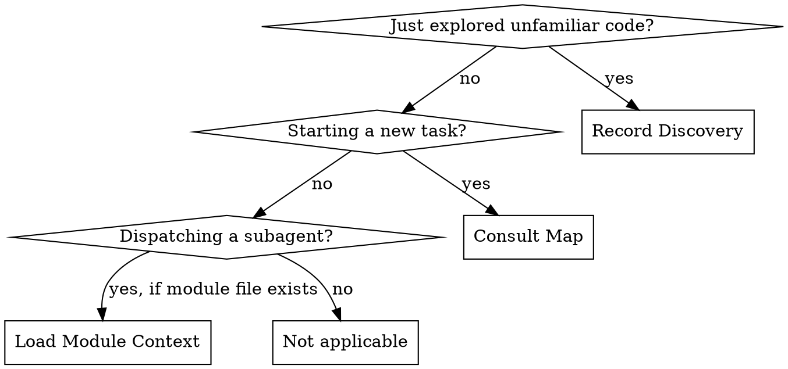
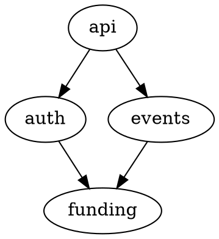

# Cartographer

## Overview

<!-- CANONICAL: shared/dispatch-convention.md -->
All subagent dispatches use disk-mediated dispatch. See `shared/dispatch-convention.md` for the full protocol.

Living architectural map of the codebase that accumulates across sessions. After exploration, captures what was learned. Before tasks, surfaces relevant structural knowledge. Subagents receive module-specific context so they don't make wrong assumptions.

**Core principle:** The agent that re-discovers the same codebase every session wastes the first 20% of every task. The Cartographer remembers the terrain.

**Announce at start:** "I'm using the cartographer skill to [record what I learned about this area / consult the codebase map / load module context for a subagent]."

## When to Use



**Three modes:**
- **Record** — after significant exploration during build, debugging, or investigation
- **Consult** — before design, planning, or execution (pairs with `crucible:forge` feed-forward)
- **Load** — when dispatching implementer/reviewer/investigator subagents into a mapped area

## Storage

All data lives in the project memory directory:

```
~/.claude/projects/<project-hash>/memory/cartographer/
  map.md                # High-level module map (max 200 lines)
  conventions.md        # Codebase patterns and conventions (max 150 lines)
  landmines.md          # Non-obvious things that break (max 100 lines)
  decisions.md          # Cross-cutting design decisions with rationale (max 200 lines)
  modules/              # Per-module detail files (max 100 lines each)
    funding.md
    auth.md
    events.md
    ...
  defect-signatures/    # Per-pattern defect signatures (max 20 files)
    YYYY-MM-DD-<slug>.md
    YYYY-MM-DD-<slug>.non-matches.md
```

### File Size Caps

| File | Max Lines | Loaded By | When |
|------|-----------|-----------|------|
| `map.md` | 200 | Orchestrator | Consult mode (every task start) |
| `conventions.md` | 150 | Implementer subagents | Included in dispatch file |
| `landmines.md` | 100 | Reviewer/red-team subagents | Included in dispatch file |
| `decisions.md` | 200 | Implementer, Reviewer, Red-team subagents | Included in dispatch file |
| `modules/<name>.md` | 100 each | Subagents working in that area | Included in dispatch file |
| `defect-signatures/<name>.md` | 30 sibling entries | Implementer, Investigator, Where Else? subagents | Matched by module name at load time |
| `defect-signatures/<name>.non-matches.md` | 100 entries (soft cap) | Investigator (truncated to 50), Where Else? (paths only) | Loaded alongside parent signature |
| Total defect signatures | 20 files | N/A | LRU pruning with 30-day age protection |

**The orchestrator only ever loads `map.md`.** Everything else stays in subagent contexts.

---

## Mode 1: Record Discovery

### When to Trigger

After any significant exploration — the agent read 5+ files, traced a call chain, investigated a module's behavior, or discovered something non-obvious about the codebase. This happens naturally during `crucible:build` and `crucible:debugging`.

### The Process

1. Dispatch a **Cartographer Recorder** subagent (Sonnet) using `./recorder-prompt.md`
2. Provide: list of files explored, what was learned, any surprises or gotchas discovered
3. Subagent returns structured updates for the relevant files
4. Write or update the appropriate files:
   - New module discovered → create `modules/<name>.md`
   - Existing module, new info → update `modules/<name>.md`
   - New convention identified → update `conventions.md`
   - New landmine found → update `landmines.md`
   - Module map changed → update `map.md`

### What Gets Recorded

**Module files (`modules/<name>.md`):**

Key Decisions should contain 1-5 entries, each 2-3 lines, consuming no more than 15 lines of the 100-line cap.

```markdown
# <Module Name>

**Path:** src/funding/
**Responsibility:** [One sentence — what this module owns]
**Boundary:** [What does NOT belong here]

## Key Components

- `ComponentName` — [what it does, 1 line]
- `AnotherComponent` — [what it does, 1 line]

## Dependencies

- **Depends on:** [modules this one imports/calls]
- **Depended on by:** [modules that import/call this one]

## Contracts

- [Implicit or explicit contracts: "processEvent() must be idempotent"]
- [API constraints: "lender API supports single lookups only, no batch"]

## Key Decisions

- **[Decision title]** ([ISO date], [ticket], [confidence if non-high]): [Why this choice was made]. Alternatives: [Alt 1] (rejected: [reason]), [Alt 2] (rejected: [reason]). Evidence: [what drove the choice].

## Gotchas

- [Non-obvious behavior: "webhook handler deduplicates via processEvent()"]
- [Historical context: "batch wrapper attempted 2024, reverted — see PR #234"]

## Last Updated

[ISO date, session context]
```

**Conventions file (`conventions.md`):**

```markdown
# Codebase Conventions

## Error Handling
- [How errors are handled: thrown, returned, Result type, etc.]

## Naming
- [File naming, function naming, variable conventions]

## Testing
- [Test patterns, helpers, fixtures — "use createTestLoan() from test/fixtures.js"]
- [What's flaky, what to avoid]

## API Patterns
- [How API handlers are structured]
- [Validation, auth, response format patterns]

## Last Updated

[ISO date]
```

**Landmines file (`landmines.md`):**

```markdown
# Landmines

Things that break non-obviously. Subagents reviewing or red-teaming should check these.

## Active Landmines

- **[Short title]** — [What breaks and why. Module: X. Severity: high/medium]
  - **Dead ends:** [hypothesis tried] — ruled out because [evidence]. (Optional)
  - **Diagnostic path:** [steps that found root cause]. (Optional)
- **[Short title]** — [What breaks and why. Module: X. Severity: high/medium]
  - **Dead ends:** [hypothesis tried] — ruled out because [evidence]. (Optional)
  - **Diagnostic path:** [steps that found root cause]. (Optional)

## Resolved Landmines

- ~~[Short title]~~ — [Resolved in session YYYY-MM-DD. How it was fixed.]

## Last Updated

[ISO date]
```

**Decisions file (`decisions.md`):**

```markdown
# Cross-Cutting Decisions

Decisions that span multiple modules or are architectural in nature.
Loaded by implementer and reviewer/red-team subagents alongside module context.

## Decisions

- **[Decision title]** ([ISO date], [ticket], modules: [list], [confidence if non-high]): [Why this choice was made]. Alternatives: [Alt 1] (rejected: [reason]), [Alt 2] (rejected: [reason]). Evidence: [what drove the choice].

## Last Updated

[ISO date]
```

**Map file (`map.md`):**

```markdown
# Codebase Map — [Project Name]

**Last updated:** [ISO date]
**Modules mapped:** N
**Coverage:** [rough % of codebase with module files]

## Module Overview

| Module | Path | Responsibility | Mapped Detail |
|--------|------|----------------|---------------|
| funding | src/funding/ | Lender communication | Yes |
| auth | src/auth/ | Authentication/authorization | Yes |
| events | src/events/ | Event processing pipeline | No (explored, not yet detailed) |

## High-Level Dependencies



## Unmapped Areas

- [Directories/modules not yet explored]

## Key Architectural Decisions

- [Top-level decisions: "monorepo with shared types", "event-driven between services"]
```

### Update Rules

1. Read the existing file before writing (merge, don't overwrite)
2. New information adds to existing sections — does not replace unless correcting an error
3. Contradictions: flag to user. "Map says X but I observed Y. Which is correct?"
4. Enforce line caps — if a module file hits 100 lines, split into sub-modules or compress
5. Mark resolved landmines with strikethrough, prune after 10 sessions
6. Update `map.md` module table whenever a new module file is created

### Defect Signature Recording

**Trigger:** After debugging Phase 4.5 "Where Else?" scan completes with 1+ candidates evaluated. The debugging orchestrator dispatches a Sonnet cartographer recorder agent.

**Skip condition:** Do not write a signature when Phase 4.5 reports "No analogous locations found" (0 candidates evaluated).

**Responsibility split:**
- **Orchestrator (debugging skill):** Owns dedup detection, pruning, count enforcement, post-recorder validation, and `update_path` file rename. See `crucible:debugging` Phase 4.5 for full orchestrator flow.
- **Recorder agent (Sonnet):** Writes exactly one signature file and one companion non-match file. Enforces per-file caps (30-entry sibling cap, 100-entry non-match cap). Does NOT manage count, pruning, dedup, or cross-file validation.

**Input to recorder:**
- Phase 4.5 scan report (generalized pattern, confirmed siblings with justifications, reverted siblings with revert reasons, confirmed non-matches with reasons)
- Original fix metadata (file path, commit SHA, commit message summary, issue number)
- Cartographer module names (the names matching `modules/<name>.md` files used during Phase 4.5; if no cartographer modules exist, fall back to file path directory prefix groupings)
- Optional: `update_path` — existing signature file to update instead of creating new

**Signature file format:**

```markdown
# Defect Signature: <short title>

**Date:** YYYY-MM-DD
**Source:** <issue number or bug description>
**Modules:** <comma-separated cartographer module names (e.g., funding, auth)>
**Last loaded:** never
**Original fix:** <file:path> — <commit SHA> — <one-line commit message summary>

## Generalized Pattern

<2-3 sentence pattern description from Phase 4.5 Step 1>

## Confirmed Siblings

- <file:path> — <one-line semantic justification>
- ...

## Unresolved Siblings

- <file:path> — <reason fix was reverted (test failure summary)>
- ...
```

**Non-match companion file format (`YYYY-MM-DD-<slug>.non-matches.md`):**

```markdown
# Non-Matches: <short title>

- <file:path> — <one-line reason why pattern does not apply>
- ...
```

**Slug generation:** First 8 hex characters of a SHA-256 hash of the generalized pattern text.

**Per-file caps:**
- Signature file: 30 sibling entries (Confirmed + Unresolved combined). If entries exceed 30, truncate Confirmed Siblings from the bottom. Never truncate Unresolved Siblings.
- Non-match companion: 100 entries (soft cap). On merge exceeding 100, drop oldest entries from top of list.

**Pruning rules (enforced by orchestrator, not recorder):**

When writing a new signature and count exceeds 20:
1. Build the pruning-eligible set: exclude signatures where `Last loaded: never` AND `Date` is less than 30 days old
2. Within the pruning-eligible set, sort by `Last loaded` date ascending; signatures with `Last loaded: never` sort oldest
3. Among ties, prune the oldest by `Date` field
4. Delete the pruned signature file and its companion non-match file (if one exists)
5. Write-before-delete ordering: always write the new file before deleting any pruned file

If no signatures are pruning-eligible, the count temporarily exceeds 20 until the next invocation.

**Path staleness:** At load time, validate that all file paths in both signatures and non-match companion files still exist on disk. Drop entries for files that no longer exist. Do NOT attempt to resolve renames.

---

## Mode 2: Consult Map

### When to Trigger

Before `crucible:design`, `crucible:planning`, or `crucible:build` begins its core work. Runs alongside `crucible:forge` feed-forward.

### The Process

1. Check if `~/.claude/projects/<project-hash>/memory/cartographer/map.md` exists
2. **Cold start (no file):** Report "No codebase map exists for this project. Will record discoveries during this session." Return immediately.
3. **Data exists:** Read `map.md` (under 200 lines — safe for context)
4. Surface relevant information to the orchestrator:
   - Which modules are likely involved in this task?
   - Are there known landmines in those areas?
   - What dependencies should be considered?
5. No subagent needed — the orchestrator reads `map.md` directly and applies it

### Cold Start Lifecycle

- **First session:** No map. Agent explores normally. Record mode captures what's found. Map begins.
- **Second session:** Map has partial coverage. Consult surfaces what's known, notes gaps.
- **After 5+ sessions:** Map covers the areas the agent works in most. Feed-forward is consistently useful.
- **After 20+ sessions:** Comprehensive coverage of the active codebase.

---

## Mode 3: Load Module Context

### When to Trigger

When dispatching an implementer, reviewer, investigator, or any subagent that will work in a mapped module area.

### The Process

1. Identify which module(s) the subagent will touch (from the task description and file paths)
2. Check if `modules/<name>.md` exists for those modules
3. If yes: read the module file(s) and include in the subagent's dispatch file
4. Also include `conventions.md` in implementer dispatch files
5. Also include `landmines.md` in reviewer and red-team dispatch files
6. Also include `decisions.md` in implementer, reviewer, and red-team dispatch files.
   This provides cross-cutting decision rationale alongside module-specific context.
7. Also load matching defect signatures from `defect-signatures/` into implementer and investigator prompts:
   - **Module matching:** Read each cartographer module file's `Path:` field. A task's file is in a module if the file path starts with the module's `Path:` value. When a task spans multiple modules, load signatures for all matched modules. When no cartographer modules exist, fall back to directory prefix matching against the signature's `Modules` field.
   - **Path staleness:** Before injecting, validate all file paths still exist. Drop stale entries silently.
   - **What to load per subagent type:** See the subagent loading table below.
   - **`Last loaded` update:** Loading is a pure-read operation. After all subagent dispatches for the current phase complete, the orchestrator batch-updates the `Last loaded` field on all signatures that were loaded during that phase.
8. If no module file exists: dispatch without it (subagent explores normally, record afterwards)
9. When loading landmines for debugging investigators and synthesis agents, include `dead_ends` and `diagnostic_path` fields for hypothesis cross-referencing. **Source-tag filtering:** Dead-end entries include a `(source: qg)` or `(source: debugging)` tag. Debugging investigators should only receive `source: debugging` entries for hypothesis cross-referencing — QG-sourced dead ends describe fix strategies, not diagnostic hypotheses, and would create noise. Reviewer and red-team subagents receive all entries regardless of source tag.

### What Each Subagent Type Gets

| Subagent Type | `conventions.md` | `landmines.md` | `decisions.md` | `modules/*.md` | `defect-signatures/*.md` | `*.non-matches.md` |
|---------------|:-:|:-:|:-:|:-:|:-:|:-:|
| Implementer | Yes | No | Yes | Yes | Yes (matching modules) | No |
| Code Reviewer | No | Yes | Yes | Yes | No | No |
| Red-Team | No | Yes | Yes | Yes | No | No |
| Investigator (debug) | No | No | No | Yes | Yes (matching modules) | Yes (truncated to 50) |
| Where Else? scan | No | No | No | Yes | Yes (max 3, matching modules) | Yes (paths only) |
| Plan Writer | No | No | No | No | No | No |

---

## Integration

### With Forge

Cartographer and Forge are complementary:
- **Forge** learns about agent behavior (process wisdom): "You tend to over-engineer"
- **Cartographer** learns about the codebase (domain wisdom): "This module has 14 consumers"
- **Together** they eliminate the `wrong-assumption` deviation type that Forge keeps logging

During feed-forward, both run:
1. `crucible:forge` feed-forward → process warnings
2. `crucible:cartographer` consult → structural awareness

During retrospective, Forge captures whether the Cartographer's information was accurate or stale.

### Skills That Should Call Cartographer

| Calling Skill | Mode | When | What to Pass |
|---------------|------|------|--------------|
| `crucible:build` | Consult | Phase 1 start (with forge feed-forward) | Task description |
| `crucible:build` | Load | Phase 3, each implementer/reviewer dispatch | Module names + file paths |
| `crucible:build` | Record | Phase 4, after completion | Files explored, modules touched |
| `crucible:debugging` | Load | Phase 1 investigator dispatch | Module names |
| `crucible:debugging` | Record | After fix verified | What was learned |

**Cartographer is RECOMMENDED, not REQUIRED.** Like Forge, it is a knowledge accelerator, not a quality gate.

## Quick Reference

| Mode | Trigger | Model | Template | Orchestrator Cost |
|------|---------|-------|----------|-------------------|
| Record | After exploration | Sonnet | `recorder-prompt.md` | ~800 tokens (result only) |
| Consult | Task begins | None (direct read) | N/A | ~4K tokens (map.md) |
| Load | Subagent dispatch | None (direct read) | N/A | 0 (subagent context only) |

## Red Flags

**Never:**
- Load ALL module files into the orchestrator (context bloat)
- Let `map.md` exceed 200 lines or module files exceed 100 lines
- Overwrite existing module information without merging
- Record speculative information ("I think this might...") — only record observed facts
- Load `landmines.md` into implementers (biases toward fear, not action)
- Load `conventions.md` into reviewers (they should judge what IS, not what SHOULD be)
- Record speculative decisions ("we might switch to X later") -- only record decisions actually made with evidence
- Put operational routing decisions (model selection, gate rounds) in Key Decisions -- those belong in forge

**Always:**
- Read existing file before updating (merge, don't replace)
- Flag contradictions to the user
- Record discoveries after significant exploration
- Check for module files before dispatching subagents
- Enforce line caps — compress or split if approaching limits
- Include at least one rejected alternative with reason for every decision entry
- Include date and source ticket for every decision entry

## Rationalization Prevention

| Excuse | Reality |
|--------|---------|
| "I'll remember this for the next task" | You won't. You're ephemeral. Write it down. |
| "This module is too simple to document" | Simple modules get modified carelessly. Document the boundary. |
| "The code is self-documenting" | Contracts, dependencies, and gotchas are NOT in the code. |
| "Map is stale, ignore it" | Stale maps with a flag are better than no map. Note what's wrong. |
| "Too many modules to map" | Map what you touch. Coverage grows naturally. |
| "Subagent doesn't need module context" | Wrong assumptions are the #1 deviation type. Context prevents them. |
| "That decision is obvious, no need to record it" | Obvious to you now. Not obvious in 10 sessions when context is gone. Record it. |
| "Too many decisions to persist" | Persist the ones with rejected alternatives. If the choice was unanimous, it doesn't need archaeology. |

## Common Mistakes

**Mapping everything at once**
- Problem: Agent tries to read the entire codebase and build a complete map in one session
- Fix: Map incrementally. Only record what you actually explored during real work. Coverage grows over sessions.

**Stale information**
- Problem: Module file says "uses REST API v2" but codebase migrated to v3
- Fix: When contradictions are observed, flag to user and update. Add "Last Updated" dates. Forge retrospectives will catch stale-map-related wrong-assumptions.

**Module files too granular**
- Problem: One file per class, 50 module files, maintenance nightmare
- Fix: Module = directory-level grouping. One file per logical module (5-15 total for most projects). Only split if a module file hits 100 lines.

**Loading module context for unrelated areas**
- Problem: Task touches `auth/`, subagent gets `funding.md` context
- Fix: Only load module files for modules the subagent will actually touch. Map the task to modules first.

## Prompt Templates

- `./recorder-prompt.md` — Post-exploration discovery recorder dispatch
