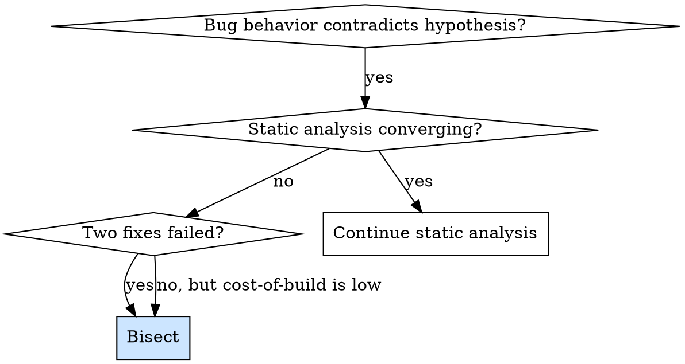
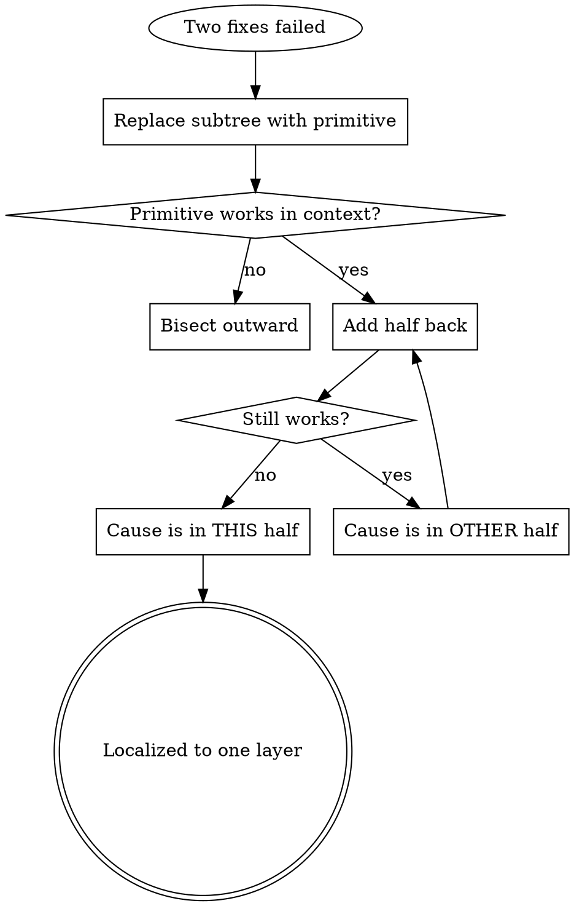

# Subtree Bisection

## Overview

When a system has layered semantics that make hypothesizing from code unreliable — animation contexts, modifier scoping, JSON merge order, AST transformations, plugin chains — static analysis can fail to predict behavior. Bisection replaces inference with empirical isolation.

**Core principle:** Replace a suspect subtree with a primitive that you know works. Confirm the primitive behaves correctly in the failing context. Then add complexity back in halves until you find the layer that breaks it. Each step is one experiment with a binary outcome.

This is `git bisect` applied to code structure instead of commit history.

## When to Use

**Use when:**
- Two reasoned fixes have already failed
- The system has scoped or context-dependent semantics (animation contexts, environment values, middleware chains, modifier ordering)
- Static analysis suggests multiple plausible causes
- Cost of running an experiment is low (one build, one test run)
- The bug is reproducible on demand

**Don't use when:**
- The cause is already obvious from a stack trace
- The bug is hard to reproduce — you can't get a clean signal per experiment
- The system is small enough that reading every line is faster than building

## Process

### 1. Replace with a Primitive

Substitute the suspect subtree with the simplest possible thing that occupies the same role: a constant, a stub, a no-op, an identity function. The goal is to prove the surrounding context works in isolation.

### 2. Confirm the Primitive Behaves Correctly

Run the failing scenario. If the primitive ALSO breaks, the bug is *outside* the subtree you suspected — bisect outward instead.

### 3. Add Complexity Back in Halves

If the primitive worked, add half of the original subtree back. Re-run. Each step gives a binary signal:
- **Pass** → cause is in the half NOT yet added; add the other half next.
- **Fail** → cause is in the half just added; bisect inside it.

### 4. Stop When You've Localized to One Layer

When adding a single small unit (one modifier, one wrapper, one middleware) breaks it, you've found the cause. Read THAT layer's code with full attention.

## Anti-Patterns

| Anti-pattern | Why it fails |
|---|---|
| "Let me try one more fix" after two failures | Three failures = your model of the system is wrong. Get data, don't guess again. |
| Bisecting by editing the suspect modifier itself | You're testing variants of your hypothesis. Replace, don't tweak. |
| Skipping step 2 (primitive confirmation) | If the surrounding context is broken, no amount of inner bisection will find it. |
| Bisecting before the bug is reproducible on demand | Noisy signal makes every step ambiguous. Stabilize repro first. |
| Bisecting changes that are too large | "Half" should be small enough to read in one sitting. If it's not, bisect the bisect. |

## Real Example: SwiftUI Animation Defect

**Symptom:** Inside a sliding bottom sheet, the show-detail content appeared "in place" at final positions while the sheet's background animated up underneath.

**Two failed hypotheses:**
1. `.appBannerOverlay`'s `.animation(_:value:)` was scoping animation context. Removed it. No change.
2. `CachedAsyncImage`'s `.animation(_:value:)` was scoping animation context. Removed it. No change.

**Bisect:**
1. Replaced the entire show-detail page with `Color.red`. Red slid up cleanly. → Bug is inside the page content.
2. Replaced with a header-only stub (artwork rect + title text + fake button). Stub slid up cleanly. → Bug is in the scrollable list, NOT the header.
3. Replaced with just `DraggableScrollView { LazyVStack { ... } }`. List broke the animation. → `DraggableScrollView` (a `UIViewControllerRepresentable`) is the boundary where SwiftUI animation context fails to propagate to UIKit-hosted content.

**Lesson:** Two animation-modifier theories were red herrings. The real cause was a UIKit hosting boundary that no amount of static analysis would have surfaced — only an empirical bisect.

## Cost Math

Each bisect step costs one build cycle. For a tree of depth N, bisection localizes the cause in log₂(N) steps. For a 5-deep view tree (~32 leaf modifiers), that's ~5 builds. For a 50-step middleware chain, ~6 builds.

Compared to: one wrong fix (build + test + observe + read) + advisor consult + retry. Bisection is usually cheaper after the second failed hypothesis.

## Key Principle

**Two failed hypotheses = your model is wrong. Get empirical data, don't guess a third time.**
