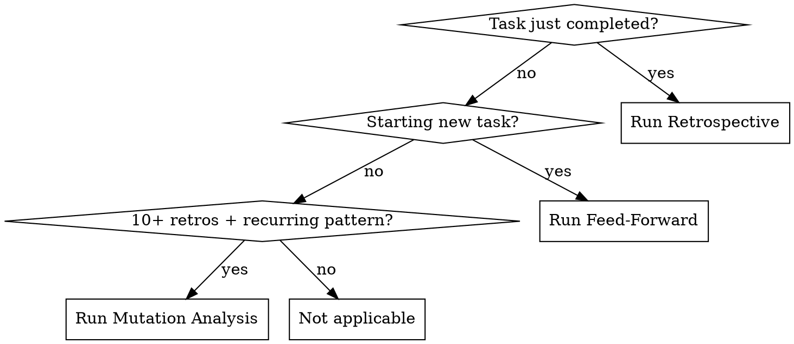

# Forge

## Overview

<!-- CANONICAL: shared/dispatch-convention.md -->
All subagent dispatches use disk-mediated dispatch. See `shared/dispatch-convention.md` for the full protocol.

Self-improving retrospective system. After tasks complete, runs structured retrospectives. Before tasks begin, consults accumulated lessons. Periodically proposes concrete skill edits based on evidence.

**Core principle:** The agent that never reviews its own performance never improves. The Forge closes the loop.

**Announce at start:** "I'm using the forge skill to [run a retrospective / consult past lessons / propose skill improvements]."

## When to Use



**Three modes:**
- **Retrospective** — after any significant task (build, debug, plan execution, branch finish)
- **Feed-Forward** — before design, planning, or execution begins
- **Mutation Proposals** — when enough data accumulates (10+ retrospectives, 3+ of same deviation type)

**Significant task** = anything that used `crucible:build`, `crucible:debugging`, or `crucible:finish`. Simple questions and file reads do not qualify.

## Storage

All data lives in the project memory directory:

```
~/.claude/projects/<project-hash>/memory/forge/
  retrospectives/
    YYYY-MM-DD-HHMMSS-<slug>.md    # Individual entries (<40 lines each)
  patterns.md                       # Aggregated patterns (max 200 lines)
  mutation-proposals/
    YYYY-MM-DD-<topic>.md           # Skill mutation proposals
  skill-proposals/
    YYYY-MM-DD-<topic>.md           # Skill extraction proposals
  chronicle/
    signals.jsonl                   # Always-on execution signals (1 line per skill completion)
    summary.md                      # Bounded summary (~100 lines, regenerated on read)
```

**Context budget:** `patterns.md` MUST stay under 200 lines. `chronicle/summary.md` MUST stay under 100 lines. Both are loaded into context during feed-forward. Individual retrospective files are NOT loaded during feed-forward — only during mutation analysis.

**Chronicle is always-on** — no config toggle. Signals contain no prompt content or task descriptions, only operational metrics (skill name, duration, outcome, files touched, skill-specific counts). This is separate from trajectory capture, which remains opt-in.

**Skill-Worthy Patterns section format** (within `patterns.md`):

```markdown
## Skill-Worthy Patterns

- **[Pattern name]** (count: N, last seen: YYYY-MM-DD): [Description]
  - Status: none | proposed ([path]) | accepted | rejected
```

## Trajectory Capture (Opt-In)

Trajectory capture records structured data about real skill invocations for eval
generation. It is OFF by default and requires explicit opt-in.

### Configuration

Check for `~/.claude/projects/<hash>/memory/trajectory-config.json` before any
trajectory operation. If the file does not exist or `enabled` is false, skip all
trajectory recording silently.

Config schema:

```json
{
  "enabled": false,
  "max_entries": 500,
  "include_prompt_summary": true,
  "additional_redact_patterns": []
}
```

- `enabled`: Master switch. Default false.
- `max_entries`: Maximum entries per JSONL file before oldest are pruned. Default 500.
- `include_prompt_summary`: Whether to include the one-line redacted prompt summary. If false, `prompt_summary` is set to "[omitted]". Default true.
- `additional_redact_patterns`: List of regex strings for project-specific secret patterns applied during the redaction pass.

### Storage

All trajectory data lives alongside other forge data:

```
~/.claude/projects/<hash>/memory/trajectories/
  trajectory_samples.jsonl     # Successful completions
  failed_trajectories.jsonl    # Failures, partial completions, aborts
```

### First-Enable Notification

When trajectory capture is first enabled (config file is created or `enabled` transitions
from false to true), output to the user:

"Trajectory capture is now enabled. Here is what this means:
- After each significant skill invocation, a structured record is appended to
  ~/.claude/projects/<hash>/memory/trajectories/
- Records include: skill name, duration, tool call count, outcome, and a redacted
  task summary. Raw prompts are NEVER stored.
- A redaction pass runs before every write to strip file paths, secrets, and
  sensitive content.
- You can inspect the JSONL files at any time. They are human-readable.
- To disable, set enabled: false in trajectory-config.json or delete the file."

### Redaction Rules

Before writing ANY trajectory entry, apply these redaction steps in order:

1. **Prompt summary generation**: Do NOT copy the user's prompt. Instead, generate
   a one-line summary that captures the task TYPE without revealing specific content.
   Good: "Add authentication middleware to REST API"
   Bad: "Add JWT auth to the Acme Corp billing API at /srv/acme/billing/api.py"
   If `include_prompt_summary` is false in config, set `prompt_summary` to "[omitted]".

2. **File path normalization**: Replace absolute paths with project-relative paths.
   Replace home directory segments with `~`. Replace username segments with `[user]`.
   Example: `/home/alice/projects/myapp/src/auth.py` becomes `~/projects/myapp/src/auth.py`
   or `src/auth.py` if within the project root.

3. **Secret pattern matching**: Scan all string fields for patterns matching:
   - API keys (strings matching `[A-Za-z0-9_-]{20,}` preceded by key/token/secret/api)
   - Connection strings (containing `://` with credentials)
   - Environment variable references with values (`KEY=value` patterns)
   - Bearer tokens, JWT strings (three dot-separated base64 segments)
   Replace matches with `[REDACTED]`.

4. **Custom patterns**: Apply each regex in `additional_redact_patterns` from the
   config file against all string fields. Replace matches with `[REDACTED]`.

5. **Set `redacted` flag**: Only set `redacted: true` after steps 1-4 complete
   successfully. If any step fails, do NOT write the entry.

### Redaction Failure

If the redaction pass cannot complete (e.g., malformed config, regex error), log a
warning and skip trajectory recording for this invocation. Do NOT write an unredacted
entry. Trajectory capture is a nice-to-have — it must never leak sensitive data.
---

## Mode 1: Post-Task Retrospective

### When to Trigger

After any skill that completes a significant task reports success. The calling skill (or orchestrator) invokes `crucible:forge` in retrospective mode.

### The Process

0. **Capture raw execution metrics** (if trajectory capture is enabled):
   Before dispatching the retrospective analyst, gather and hold in context:
   - Skill name that just completed
   - Start timestamp (from pipeline status "Started" field or session start)
   - End timestamp (current time)
   - Tool call count estimate (from execution summary or narration log)
   - Error recovery event count (how many times an error was encountered and retried)
   - User acceptance signal (did the user approve the output, request changes, or reject it?)
   - Phases reached (for build: design/plan/execute/review; for debugging: investigate/hypothesize/fix/verify; etc.)
   - Completion status (did the skill reach its natural end?)

   These raw metrics are NOT written to disk yet. They are held in context for
   step 8 (trajectory recording) after the retrospective completes, where they
   are merged with the retrospective's analytical output (deviation type, outcome,
   tags) to form the complete trajectory entry.

   If trajectory capture is disabled, skip this step.

1. Dispatch a **Retrospective Analyst** subagent (Sonnet) using `./retrospective-prompt.md`
2. Provide: task description, the plan (if any), actual execution summary, skills used, duration estimate
3. Subagent returns structured retrospective entry
4. Write entry to `~/.claude/projects/<project-hash>/memory/forge/retrospectives/YYYY-MM-DD-HHMMSS-<slug>.md`
5. Update `patterns.md` — read current file, merge new findings, rewrite
6. For debugging sessions, the retrospective also extracts diagnostic patterns using a dedicated extraction subagent (Opus). Dispatch using `./diagnostic-extraction-prompt.md`. Patterns are written to cartographer's landmines via `crucible:cartographer` (record mode) with `dead_ends` and `diagnostic_path` fields. Tag dead-end entries with `(source: debugging)`.
6b. For build sessions with QG fix journals: glob for `~/.claude/projects/<project-hash>/memory/quality-gate/fix-journal-*.md`. For each handoff file found:
    a. Read `landmines.md` and check for existing entries matching the same module + same failed approach (same file path AND same module AND 3+ non-stopword shared terms). If matching entries exist, skip extraction — handoff was already processed. Delete the handoff file.
    b. If no match: dispatch the diagnostic extraction subagent (Opus) using `./diagnostic-extraction-prompt.md` with the QG-specific addendum (see that file's "Source Context: Quality Gate Fix Journal" section). Tag dead-end entries with `(source: qg)`.
    c. Write extracted dead ends to cartographer's landmines via `crucible:cartographer` (record mode).
    d. Delete the handoff file after successful extraction.
    e. **Cap-pressure behavior:** If `landmines.md` is within 10 lines of its 100-line cap, write only Fatal-severity dead ends. At cap, skip and emit a chronicle signal: `{ "event": "dead_end_cap_skip", "module": "<module>", "source": "qg" }`.
7. For build sessions with a decision journal, the retrospective also extracts
   substantive design decisions. The retrospective analyst identifies decisions
   that are NOT operational routing (reviewer-model, gate-round, task-grouping,
   cleanup-removal types from the journal) but are substantive design choices
   (technology selection, API design, architecture, constraint trade-offs).
   These are passed to a cartographer recorder dispatch with the
   "Extract decisions for cartographer" directive, alongside the module
   mapping from the build session's task list and design doc.
8. **Trajectory recording** (if trajectory capture is enabled):
   a. Check `~/.claude/projects/<hash>/memory/trajectory-config.json` — if missing
      or `enabled: false`, skip this step entirely.
   b. Construct the raw trajectory entry from execution data available in context:
      - `trajectory_id`: Generate a UUID
      - `timestamp`: ISO-8601 of when the skill invocation started
      - `skill`: The Crucible skill that was invoked (build, debugging, audit, etc.)
      - `completed`: Whether the skill ran to its natural completion
      - `outcome`: Derived from the retrospective's `outcome` field (success/partial/failure)
      - `duration_ms`: From pipeline status timestamps or session timing
      - `tool_call_count`: Estimated from execution summary
      - `error_recovery_events`: Count of error-then-retry sequences observed
      - `user_acceptance`: Whether the user accepted the output (accepted/rejected/modified/unknown)
      - `phases_reached`: For multi-phase skills, which phases completed
      - `deviation_type`: From the retrospective entry
      - `prompt_hash`: SHA-256 of the original user prompt
      - `prompt_summary`: One-line redacted summary (if `include_prompt_summary` is true)
      - `redacted`: Set to true only after step (c) completes
      - `tags`: From the retrospective entry's tags
   c. Run the redaction pass (see Redaction Rules above).
   d. Append the entry as a single JSON line to the appropriate file:
      - If `completed == true` AND `outcome == "success"`: append to `trajectory_samples.jsonl`
      - Otherwise: append to `failed_trajectories.jsonl`
   e. Check file size: if the target file exceeds `max_entries` lines, remove the
      oldest entries (from the top of the file) to bring it back to `max_entries`.
8.5. **Chronicle signal** (always-on — runs regardless of trajectory capture config):
   a. Construct signal entry from execution data already in context:
      - `v`: 1 (schema version)
      - `ts`: ISO-8601 completion timestamp
      - `skill`: The Crucible skill that just completed
      - `outcome`: From retrospective's outcome field (success/failure/partial)
      - `duration_m`: Wall clock minutes from start to completion
      - `branch`: Current git branch
      - `files_touched`: Project-relative paths of files modified during the skill invocation
      - `metrics`: Skill-specific metrics bag (see table below)
   b. Append as a single JSON line to `~/.claude/projects/<hash>/memory/chronicle/signals.jsonl`
   c. If the file or directory doesn't exist, create it
   d. This step does NOT require redaction — signals contain no prompt content,
      task descriptions, or secrets. Only operational facts.

   **Example signal:**
   ```jsonl
   {"v":1,"ts":"2026-03-25T10:00:00Z","skill":"build","outcome":"success","duration_m":42,"branch":"feat/auth-refactor","files_touched":["src/auth/token.ts","src/auth/refresh.ts"],"metrics":{"mode":"feature","tasks":5,"tasks_passed":5,"qg_rounds":3,"review_rounds":2,"stagnation":false}}
   ```

   **Metrics bag by skill:**

   | Skill | Metrics |
   |-------|---------|
   | build | mode, tasks, tasks_passed, qg_rounds, review_rounds, stagnation |
   | debugging | hypotheses, root_cause_category, where_else_hits |
   | quality-gate | artifact_type, rounds, fatals_found, stagnation |
   | design | questions_investigated, auto_resolved |
   | planning | task_count, review_rounds |
   | audit | findings_count, lenses_dispatched |
   | code-review | rounds, findings_by_severity |
   | TDD | cycles, red_green_refactor_count |

   **Signal scope rule:** Emit one signal per top-level skill invocation, not per
   sub-skill dispatch. When build calls quality-gate internally, quality-gate does
   NOT emit its own signal — its metrics are captured in build's metrics bag.
   Standalone invocations of quality-gate, code-review, etc. DO emit signals.

   This is self-enforcing: forge retrospective only runs at the end of a top-level
   skill invocation, so Step 8.5 naturally fires once per top-level skill. Sub-skills
   called within build do not trigger their own forge retrospective.

9. **Skill extraction check (all sessions):** Evaluate the just-produced
   retrospective entry against the following trigger heuristics. If ANY
   trigger fires, dispatch a Skill Extraction Analyst subagent (Sonnet)
   using `./extraction-analyst-prompt.md`.

   **Trigger heuristics (ANY fires = dispatch analyst):**
   - **Complexity**: Execution summary references 5+ distinct tool calls or
     subagent dispatches in a non-trivial sequence (sequential steps with
     dependencies, not parallel reads of unrelated files)
   - **Error recovery**: "What Went Wrong" describes errors that were overcome
     AND "What Worked" credits a specific approach for the recovery
   - **User correction**: Execution summary notes user redirection that led
     to a successful outcome different from the original approach
   - **Novel workflow**: "What Worked" describes a pattern not present in any
     existing skill's SKILL.md description frontmatter (check skill names
     and descriptions against the pattern)
   - **Recurrence**: The positive pattern in "What Worked" matches an existing
     entry in patterns.md "Skill-Worthy Patterns" with count >= 2, AND no
     proposal has been generated for it yet

   **Dispatch input:** retrospective entry, execution summary, existing skill
   names/descriptions, existing proposals in skill-proposals/ and
   mutation-proposals/.

   **Handle output:**
   - "No proposal warranted" -> Record pattern name in patterns.md
     Skill-Worthy Patterns section (increment count or add new entry)
   - NEW SKILL proposal -> Write to skill-proposals/YYYY-MM-DD-<topic>.md,
     update patterns.md entry with status: proposed
   - EXTEND EXISTING proposal -> Write to mutation-proposals/YYYY-MM-DD-<topic>.md
     with `source: extraction` tag, update patterns.md entry with status: proposed

   This step is RECOMMENDED, not REQUIRED. Failure does not break the
   retrospective. If the analyst cannot determine skill-worthiness, record
   the pattern and move on.

### Update Rules for patterns.md

1. Read the current `patterns.md` (create if first retrospective)
2. Increment counts based on new retrospective
3. Recalculate percentages and trends
4. Add new warnings only if a pattern appears **2+ times** (single occurrences stay in individual files only)
5. Prune warnings that have not occurred in the last 10 retrospectives (pattern may be resolved)
6. Keep total file **under 200 lines** — compress or remove stale entries
7. Write the updated file
8. Update the "Skill-Worthy Patterns" section:
   - If the retrospective's "What Worked" section describes a reusable pattern, add or increment it
   - Each entry: pattern name, occurrence count, last-seen date, proposal status (none|proposed|accepted|rejected)
   - Maximum 10 entries, 2 lines each
   - Prune patterns not seen in last 10 retrospectives (same rule as warnings)
   - Mark patterns as "resolved" (compress to single line) when their proposal has been accepted or rejected

### After Writing

If total retrospective count >= 10 AND any deviation type has 3+ occurrences, suggest to user:
> "Forge has accumulated enough data for skill improvement proposals. Would you like to run mutation analysis?"

If a skill extraction proposal was generated in step 9, notify the user:
> "Forge detected a skill-worthy workflow: [proposed skill name or extension target]. Proposal written to [path]. When you're ready, you can use skill-creator with this proposal as a starting point."

Do NOT prompt for immediate action. The notification is informational. The user
decides when (or whether) to act on it.

### Trajectory Recording Without Retrospective

Forge retrospective is RECOMMENDED but not REQUIRED. When a significant skill
completes but no retrospective is triggered (user declines, session ending, quick
task), trajectory data would be lost.

To handle this, any skill that completes a significant task SHOULD write a
minimal trajectory entry if:
- Trajectory capture is enabled
- No forge retrospective is expected to run in this session

The minimal entry uses `deviation_type: "unknown"`, `tags: []`, and
`outcome` based on the completion signal alone (success if the skill reported
success, failure if it reported failure, partial otherwise). The entry still
goes through the full redaction pass.

This ensures trajectory data is captured even when forge does not run, at the
cost of less-rich analytical fields. The skill-creator's eval generation pipeline
handles entries with `deviation_type: "unknown"` by clustering on execution
metrics alone.

Similarly, any skill that completes a significant task SHOULD append a minimal
chronicle signal if no forge retrospective is expected to run. The minimal signal
uses `outcome` from the skill's own completion status, `files_touched` from
`git diff --name-only`, and whatever metrics are available in context. Chronicle
signals require no redaction (they contain no prompt content), so the fallback
path is simpler than trajectory fallback. This ensures chronicle data is captured
even when forge does not run.

---

## Mode 2: Pre-Task Feed-Forward

### When to Trigger

Before `crucible:design`, `crucible:planning`, or `crucible:build` begins its core work.

### The Process

1. Check if `~/.claude/projects/<project-hash>/memory/forge/patterns.md` exists
2. **Cold start (no file):** Report "No prior retrospective data for this project. Proceeding without feed-forward." Return immediately. No subagent needed.
3. **Data exists:** Read `patterns.md` (under 200 lines — safe for context)
3.5. **Chronicle context** (always-on):
    a. Check if `~/.claude/projects/<hash>/memory/chronicle/signals.jsonl` exists
    b. If not found: skip (cold start — no chronicle data yet)
    c. If found: compare `signals.jsonl` mtime with `chronicle/summary.md` mtime
       - If `summary.md` doesn't exist OR `signals.jsonl` is newer: regenerate `summary.md`
       - **Regeneration:** Read all signals from `signals.jsonl`, compute:
         - **Hotspots:** Group `files_touched` by cartographer module (if module maps exist
           in `memory/cartographer/modules/`) or by directory prefix. A module qualifies as
           a hotspot when it has 3+ signals with friction indicators (`stagnation=true`,
           `metrics.qg_rounds>2`, `skill="debugging"`, or `outcome="failure"/"stagnation"`).
           Show top 5 hotspots sorted by signal count.
         - **Skill Performance:** Aggregate runs, avg duration, avg QG rounds, stagnation
           rate, success rate per skill. Cap at 8 rows.
         - **Trends:** Compare last 10 signals vs prior 10 for key metrics.
         - **Recent Friction:** Last 5 signals with friction indicators.
         - **Hard cap at 100 lines** — drop Trends and Recent Friction sections first if needed.
       - Write regenerated summary to `chronicle/summary.md`
    d. Load `chronicle/summary.md` into context alongside `patterns.md`
    e. Pass both to the Feed-Forward Advisor in Step 4
3.7. **Dead-end context** (if cartographer data exists):
    a. Check if `~/.claude/projects/<project-hash>/memory/cartographer/landmines.md` exists
    b. If not found: skip (no dead-end data yet)
    c. If found: identify the upcoming task's target file paths from the task description. Resolve each to a cartographer module via `Path:` prefix matching (same logic as Cartographer Mode 3 Load step 7). Scan `landmines.md` for entries with file paths resolving to the same modules.
    d. If 0 matching entries: skip
    e. If 1+ matching entries: extract the matching entries (both `source: qg` and `source: debugging`). Pass to the Feed-Forward Advisor in Step 4 under the "Dead-End Context" section.
    **Note:** Forge scans `landmines.md` directly rather than routing through Cartographer Mode 3 Load to avoid coupling — feed-forward works even when no Cartographer consult runs in the current session.
4. Dispatch a **Feed-Forward Advisor** subagent (Sonnet) using `./feed-forward-prompt.md`
4b. **Trajectory context** (if trajectory capture is enabled):
    Also read `~/.claude/projects/<hash>/memory/trajectories/failed_trajectories.jsonl`
    and extract the 5 most recent failure entries for the upcoming skill type.
    Pass these to the Feed-Forward Advisor alongside patterns.md.
    The advisor can surface trajectory-specific warnings like:
    - "Last 3 build invocations failed at the execute phase with error recovery"
    - "Debugging tasks on this project have a 40% failure rate — consider more
      investigation before committing to a fix"
    If no trajectory data exists, skip this addition.
5. Provide: the patterns file content, chronicle summary (if available from Step 3.5), AND a brief description of the upcoming task
6. Subagent returns 3-5 targeted warnings/adjustments relevant to THIS task
7. Surface warnings to the calling skill's orchestrator as bias adjustments (not hard blockers)

### Cold Start Lifecycle

- **First task:** No feed-forward (no data). Retrospective runs after completion. This produces data.
- **Second task:** Feed-forward has 1 data point. Advisor notes "limited data" but still surfaces any relevant warning.
- **After 3+ tasks:** Chronicle hotspots start to form. Summary becomes useful.
- **After 5+ tasks:** Feed-forward becomes meaningfully useful.
- **After 10+ tasks:** Mutation proposals become available. Chronicle trends become meaningful.

---

## Mode 3: Skill Mutation Proposals

### When to Trigger

When `patterns.md` shows 10+ total retrospectives AND recurring patterns (3+ occurrences of same deviation type). Can also be invoked manually.

### The Process

1. Read `patterns.md` and ALL individual retrospective files in `retrospectives/`
2. Dispatch a **Mutation Analyst** subagent (Opus) using `./mutation-proposal-prompt.md`
3. Provide: the full patterns file, all retrospective entries, and a list of current skill names
4. Subagent analyzes patterns and proposes concrete skill edits
5. Write proposals to `~/.claude/projects/<project-hash>/memory/forge/mutation-proposals/YYYY-MM-DD-<topic>.md`
6. Surface proposals to the user — **NEVER auto-modify skills**

### The Iron Law of Mutations

```
NEVER AUTO-MODIFY SKILLS. PROPOSALS ONLY.
```

The Forge produces proposals for human review. It does not edit skill files. It does not dispatch subagents to edit skill files. It does not suggest "just making this small change." Every mutation requires explicit human approval.

---

## Integration

### Skills That Should Call Forge

| Calling Skill | Mode | When | What to Pass |
|---------------|------|------|--------------|
| `crucible:build` | Feed-Forward | Phase 1 start | Feature description |
| `crucible:build` | Retrospective | Phase 4, after red-team, before finishing | Full build summary |
| `crucible:debugging` | Retrospective | After fix verified | Bug description + hypothesis log |
| `crucible:debugging` | Retrospective (diagnostic extraction) | After fix verified | Session artifacts → cartographer landmines with `dead_ends` + `diagnostic_path` |
| `crucible:finish` | Retrospective | After Step 3, before Step 4 | Branch summary + review findings |
| `crucible:design` | Feed-Forward | Before first question | Topic description |
| `crucible:build` | Retrospective (decision extraction) | After fix verified | Decision journal + task list → cartographer decisions via recorder |
| Any skill | Trajectory Record | After retrospective step 7 | Execution data + retrospective output (opt-in only) |
| Any skill | Chronicle Signal | After retrospective step 8 | Execution metrics (always-on) |

**Forge is RECOMMENDED, not REQUIRED.** It is a learning accelerator, not a quality gate. Skipping it does not produce broken output — it misses an opportunity to learn.

**Skill extraction** is an internal step within Mode 1 (Retrospective). It does
not require any calling skill to pass additional data -- the retrospective entry
itself provides the input. The extraction analyst may read existing skill
descriptions from the skill directories to check for overlap.

## Quick Reference

| Mode | Trigger | Model | Template | Output |
|------|---------|-------|----------|--------|
| Retrospective | Task completes | Sonnet | `retrospective-prompt.md` | Entry file + patterns.md update |
| Feed-Forward | Task begins | Sonnet | `feed-forward-prompt.md` | 3-5 targeted warnings |
| Mutation | 10+ retros + manual | Opus | `mutation-proposal-prompt.md` | Proposal doc for human review |

## Red Flags

**Never:**
- Skip retrospective because "task was simple"
- Let `patterns.md` exceed 200 lines
- Auto-modify any skill file
- Load individual retrospective files into feed-forward (context bloat)
- Run mutation analysis with fewer than 10 retrospectives
- Treat feed-forward warnings as hard blockers (they are advisories)
- Auto-create skills from extraction proposals (Iron Law applies to extraction too)
- Dispatch skill-creator from within the forge pipeline
- Generate skill proposals for trivial workflows (single-step, domain-specific)
- Propose a new skill when an existing skill already covers the workflow
- Store raw user prompts in trajectory files — only store prompt hashes and redacted summaries
- Write a trajectory entry without completing the redaction pass
- Auto-enable trajectory capture — it must be explicitly opted into via config file
- Include prompt content or task descriptions in chronicle signals — signals are operational metrics only

**Always:**
- Run retrospective after significant tasks
- Check for patterns.md before design/planning
- Write mutation proposals to disk for human review
- Handle cold start gracefully (no data = no feed-forward, just say so)
- Check existing skill descriptions before flagging a workflow as "novel"
- Include confidence level on every extraction proposal
- Write proposals to disk before notifying the user
- Check trajectory-config.json before any trajectory operation
- Run the full redaction pass before writing any trajectory entry
- Set `redacted: true` only after the redaction pass completes
- Append a chronicle signal after every significant task retrospective (Step 8.5)

## Rationalization Prevention

| Excuse | Reality |
|--------|---------|
| "Task was too simple for a retrospective" | Simple tasks reveal patterns too. 2 minutes max. |
| "No time for retrospective" | Retrospective prevents the NEXT task from repeating the mistake. |
| "Feed-forward data is stale" | Prune mechanism handles staleness. Read it anyway. |
| "Mutation proposal is obviously correct, just apply it" | Iron Law: proposals only. Humans decide. |
| "Only one data point, feed-forward is useless" | Even one warning is better than none. Report limited data. |
| "I'll run the retrospective later" | Later never comes. Run it now, while context is fresh. |
| "I already know what went wrong" | Knowing is not recording. Write it down so FUTURE sessions know too. |
| "This workflow is obviously worth a skill, just create it" | Iron Law: proposals only. Humans decide. Even the best-looking workflow may be a one-off. |
| "Every session has a skill-worthy pattern" | If >30% of retrospectives trigger proposals, the heuristics are too loose. Tighten them. |
| "The proposal is low-confidence, not worth writing" | Low-confidence proposals are seeds. They become medium when they recur. Write them down. |
| "Trajectory data is too noisy to be useful" | Even noisy data reveals patterns at scale. 10 failed trajectories with the same deviation type IS a signal. |
| "I'll enable trajectory capture later" | Later means no data for the current project. Enable it now if you want eval generation from real usage. |
| "The redaction pass is too conservative" | Conservative redaction protects the user. A missed eval scenario is cheaper than a leaked secret. |
| "This task is too small to record" | Small tasks reveal patterns too. The trajectory entry is one JSON line — the cost is negligible. |

## Common Mistakes

**Bloating patterns.md**
- Problem: patterns.md grows past 200 lines, consuming context budget
- Fix: Prune patterns not seen in last 10 retros. Compress entries. Merge similar warnings.

**Skipping feed-forward on cold start**
- Problem: Announcing "no data" without checking the file path
- Fix: Always check the file path. If missing, say so and proceed. If exists with 1 entry, use it.

**Treating warnings as requirements**
- Problem: Feed-forward says "watch for over-engineering" and agent refuses to build anything
- Fix: Warnings are bias adjustments, not hard constraints. Note them and proceed.

**Running mutation analysis too early**
- Problem: 3 retrospectives, agent proposes sweeping skill changes
- Fix: Minimum 10 retrospectives. Below that, patterns are noise.

**Proposing skills for domain-specific workflows**
- Problem: Agent proposes a skill for "deploying to our specific Kubernetes cluster" -- a workflow only useful for this one project
- Fix: The extraction analyst must assess generalizability. Workflows that reference project-specific infrastructure, APIs, or conventions are positive patterns, not skill candidates.

**Ignoring extraction proposals**
- Problem: Proposals accumulate in skill-proposals/ and are never reviewed
- Fix: During feed-forward, the advisor can surface pending proposals as a reminder: "N skill proposals awaiting review." Users should periodically review and accept/reject.

**Duplicate proposals from extraction and mutation**
- Problem: Mode 3 mutation analysis recommends a new skill that extraction already proposed
- Fix: Mutation analyst cross-references skill-proposals/ before recommending new skills. If a proposal exists, add evidence to it.

## Prompt Templates

- `./retrospective-prompt.md` — Post-task retrospective analyst dispatch
- `./feed-forward-prompt.md` — Pre-task feed-forward advisor dispatch
- `./mutation-proposal-prompt.md` — Skill mutation analyst dispatch
- `./diagnostic-extraction-prompt.md` — Debugging session diagnostic pattern extraction dispatch
- `./extraction-analyst-prompt.md` -- Skill-worthy workflow detection and proposal generation dispatch
