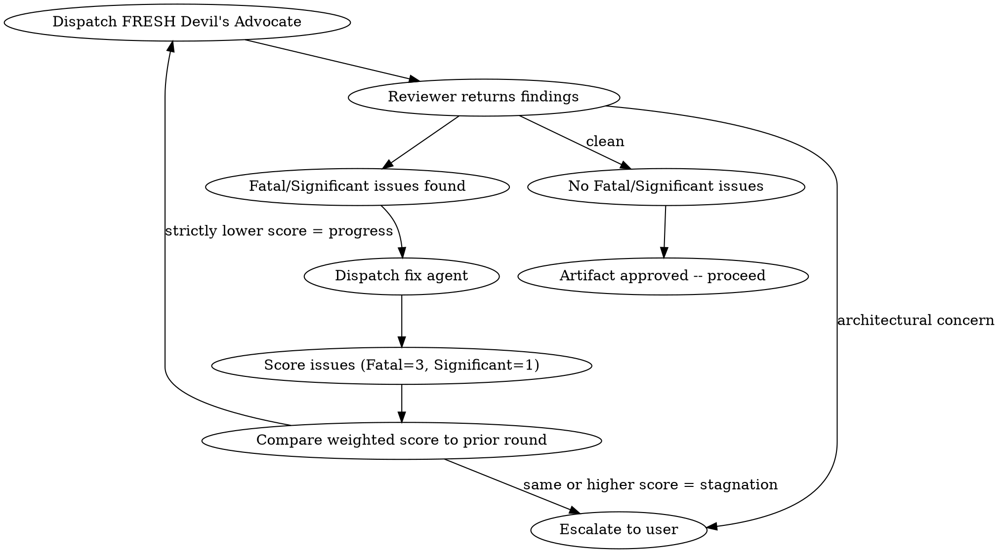

# Red Team

## Overview

<!-- CANONICAL: shared/dispatch-convention.md -->
All subagent dispatches use disk-mediated dispatch. See `shared/dispatch-convention.md` for the full protocol.

Adversarial review of any artifact. Dispatches a Devil's Advocate subagent to attack the work, fixes findings, then dispatches a FRESH Devil's Advocate to attack again. Iterates until clean or stagnation is detected.

**Core principle:** Fresh eyes every round. No anchoring, no confirmation bias.

**Announce at start:** "I'm using the red-team skill to adversarially review this artifact."

## Skill Arguments (added by #303)

| Argument | Type | Default | Effect |
|---|---|---|---|
| `cost_cap_threshold` | int \| null | `3` if `suppression_threshold > 3` else `null` (auto-null on hypothesis/mockup/translation defaults) | Standalone-mode only: LOCAL round at which the cost-cap prompt fires (interactive only). Set to `null` to disable. |
| `dr_signal_findings` | int \| null | `2` if `suppression_threshold > 3` else `null` | Standalone-mode only: count of NEW (delta-vs-prior-round) Fatal+Significant findings at or below which the DR signal fires (interactive only). |

These args apply ONLY in standalone-mode iterative-loop invocations. When red-team is invoked single-pass by `crucible:quality-gate`, QG owns the loop and these args are ignored — QG emits its own ledger.

**Term definitions (standalone red-team).** Both defaults above reference two values red-team resolves at invocation:

- `suppression_threshold` — the artifact-type-keyed pre-threshold suppression value, identical to quality-gate's (see `skills/quality-gate/SKILL.md`): **10** for code artifacts, **3** for hypothesis / mockup / translation artifacts. The `> 3` test is therefore true only for code, so the cost-cap and DR signals auto-enable for code artifacts and auto-null for the threshold-3 artifact types (matching QG's INV-303-5).
- `interactive` — whether this invocation may prompt the user. True for a user-invoked standalone `/red-team`; false when a non-interactive caller (e.g., `build` / `finish`) drives the loop. In non-interactive mode the signals log to the ledger instead of prompting (see the DR and cost-cap rules below).

## When to Use

- After a design doc is finalized (before planning)
- After an implementation plan passes review (before execution)
- After implementation is complete (before finishing)
- Anytime you want adversarial review of any artifact
- When the build pipeline calls for red-teaming

## The Iterative Loop



### Rules

1. **Fresh reviewer every round** — dispatch a NEW subagent each time. Never pass prior findings to the next reviewer. Each reviewer sees the artifact cold.
2. **Stagnation = escalation** — use weighted scoring to detect stagnation (see below). If the weighted score does not strictly decrease, stop and escalate to user with full findings from both rounds.
3. **Architectural concerns bypass the loop** — immediate escalation regardless of round or progress.
4. **No round cap** — loop as long as each round makes progress. The caller (e.g., `crucible:quality-gate`) may impose a global safety limit.
5. **Only Fatal and Significant count** — Minor observations are logged but don't count toward stagnation and don't trigger fix rounds.

### Stagnation Detection

Stagnation uses **weighted scoring**, not raw issue counts. This prevents false stagnation when Fatal issues are converted to Significant ones (which is genuine progress).

**Weights:** Fatal = 3 points, Significant = 1 point.

**Example:** Round 1 finds 2 Fatal + 1 Significant = score 7. Fixer eliminates both Fatals but surfaces 3 new Significants. Round 2 finds 0 Fatal + 3 Significant = score 3. That is progress (3 < 7), not stagnation.

**Progress requires EITHER:**
- Weighted score strictly lower than prior round, OR
- Fatal count strictly lower AND weighted score same-or-lower

**If neither condition is met, that is stagnation.** Escalate to user with findings from both rounds.

### Issue Classification

The Devil's Advocate MUST classify every challenge:
- **Fatal:** Artifact will fail or produce broken output. Must be addressed.
- **Significant:** Artifact will work but has a meaningful risk or missed opportunity. Should be addressed.
- **Minor:** Nitpick or preference. Log it but don't block.

### Per-Round Ledger and Cost-Cap Signals (standalone mode only, #303)

**Per-round ledger (standalone mode only, #303):** After each round's findings are produced and before the fix dispatch (if non-clean) or the round's terminal write (if clean), emit `round-N-ledger.md` to the run's scratch directory in this format:

```
# Round N Ledger

Artifact-type: <code | hypothesis | mockup | translation>
Total findings: N (F: x, S: y, M: z)
New since round N-1: K   (on round 1, K = total findings — no prior round)
Accepted: P (all findings — v0.1)
Deferred: 0 (v0.1 — see issue #305 for v1.0)
DR signal: <fired | not fired>
Cost-cap signal: <fired | not fired>

## Accepted
- [Fatal] <finding-id>: <one-line summary>
- [Significant] <finding-id>: <one-line summary>

## Deferred (v1.0 — empty in v0.1)
(none)
```

The ledger is emitted every round regardless of `cost_cap_threshold` / `dr_signal_findings` values (those args control prompts, not emission).

**Diminishing-return signal (standalone-mode, interactive only, #303):** When `dr_signal_findings != null` AND LOCAL round ≥ 2 AND the count of NEW (delta-vs-prior-round) Fatal+Significant findings ≤ `dr_signal_findings`, emit prompt: "Red-team round N surfaced only K NEW Fatal+Significant findings. Diminishing returns reached. Continue or escalate?" Non-interactive: log `DR signal: fired` in the round ledger; no prompt; loop continues.

**Cost-cap prompt (standalone-mode, interactive only, #303):** When `cost_cap_threshold != null` AND LOCAL round ≥ `cost_cap_threshold`, emit prompt: "Red-team round N (cost-cap threshold = T). Score progression: [list]. Continue or escalate?" Non-interactive: log `Cost-cap signal: fired` in the round ledger; no prompt; loop continues.

**Combined-prompt rule:** When both signals fire in the same round in interactive mode, emit ONE combined prompt: "Red-team round N: cost-cap exceeded (threshold T) AND diminishing returns (K NEW findings ≤ S). Continue or escalate?"

## How to Use

### 1. Determine artifact type and fix mechanism

| Artifact | Fix Mechanism |
|---|---|
| Design doc | Plan Writer subagent revises the doc |
| Implementation plan | Plan Writer subagent revises the plan |
| Code / implementation | Fix subagent (new, not the original implementer) |
| Documentation | Fix subagent |
| Standalone invocation | Caller decides |

### 2. Dispatch Devil's Advocate

Use the `red-team-prompt.md` template in this directory. Provide:
- The full artifact content (include in dispatch file, don't make the subagent read files)
- Project context (existing systems, constraints, tech stack)
- What the artifact is supposed to accomplish

Dispatched as the `crucible-red-team` agent type, which pins the model to **Opus** —
adversarial analysis needs the best model (see `agents/crucible-red-team.md`). The pin
is enforced by the agent def regardless of the orchestrator's own model; do not pass a
call-level `model:`.

If `subagent_type: crucible-red-team` fails to resolve (the agent defs are not installed —
see `shared/harness-adapter.md` §8), fall back to `general-purpose` on the inherited model
and emit a one-time visible warning ("agent type `crucible-red-team` not installed; the
red-team is running on the inherited/session model — recall guarantee NOT enforced; install
per harness-adapter §8") rather than degrading silently. The trigger is the observable
type-resolution failure, not a transcript/metadata read.

### 3. Process findings

- **No Fatal/Significant issues:** Artifact is approved. Proceed.
- **Fatal/Significant issues found:** Compute the weighted score (Fatal=3, Significant=1). Dispatch fix mechanism. Then go to step 4.
- **Architectural concerns:** Escalate to user immediately. Do not attempt to fix.

### 4. Re-review after fixes

Dispatch a NEW Devil's Advocate subagent (fresh, no prior context, `subagent_type: crucible-red-team`). Compute weighted score and compare:
- **Strictly lower weighted score:** Progress. Loop back to step 3.
- **Same or higher weighted score:** Stagnation. Escalate to user with findings from both rounds.

## What the Devil's Advocate is NOT

- A code reviewer (don't check style, naming, or quality — that's `crucible:temper`)
- A blocker for the sake of blocking — challenges must be specific and actionable
- A rewriter — they challenge, they don't produce an alternative

## Depth Calibration

If a reviewer returns fewer findings than expected, the review is likely shallow. Dispatch a second reviewer (`subagent_type: crucible-red-team`, same Opus pin) with the instruction: "A prior reviewer found N issues. Find what they missed."

| Artifact | Expected findings (Fatal + Significant) | Minimum dimensions covered |
|---|---|---|
| Design doc | 5-10 | All 6 |
| Implementation plan | 3-8 | Fatal Flaws, Hidden Risks, Fragility, Assumptions |
| Code (feature) | 3-6 | Fatal Flaws, Hidden Risks, Fragility |
| Code (refactor) | 2-5 | Fatal Flaws, Assumptions, Completeness |

These are guidelines, not quotas. A genuinely clean artifact with 1 finding and thorough dimension coverage is fine. A 1-finding review that only addresses one dimension is shallow regardless of the artifact.

## The Iron Law

```
No artifact ships without adversarial review.
Code review is necessary but not sufficient.
```

Code review checks quality — is the code correct, clean, well-structured? Red-teaming attacks assumptions — will this actually work under adversarial conditions? What happens when inputs are hostile, dependencies fail, or load exceeds expectations? These are non-overlapping concerns. Passing code review is not evidence that red-teaming is unnecessary.

## Rationalization Prevention

| Excuse | Reality |
|--------|---------|
| "Code review already passed" | Code review and red-teaming have non-overlapping coverage. Review checks quality; red-teaming attacks assumptions under adversarial conditions. Both are required. |
| "This is a minor change" | Minor changes in critical paths have disproportionate blast radius. Small diffs are where subtle bugs hide — less code to review means less obvious where to look. |
| "We're behind schedule" | Skipping adversarial review saves hours now, costs days when the issue surfaces in production. Red-teaming is the cheapest place to find these issues. |
| "The design was thorough" | Thorough designs have thorough failure modes. Complexity = attack surface. The more thought went in, the more assumptions to challenge. |
| "Just a refactor, behavior unchanged" | Refactors are where equivalence assumptions hide. Red-team verifies the equivalence claim — the most dangerous bugs are ones where "nothing changed" but something did. |
| "Quality gate will catch it later" | Quality gate invokes red-team. Skipping here means skipping there. |
| "The inquisitor already tested it" | Inquisitor writes executable tests for cross-component behavior. Red-team attacks design assumptions and failure modes that can't be expressed as tests. Different tools. |
| "We already did N rounds" | Prior rounds found things to fix. That's evidence the artifact needed review, not evidence it's now clean. Fresh eyes, every round. |

## Red Flags

**Process violations — Never:**
- Reuse the same reviewer subagent across rounds
- Pass prior findings to the next reviewer
- Skip re-review after fixes ("the fixes look fine, let's move on")
- Ignore Fatal issues
- Proceed with unfixed Significant issues

**Skip rationalizations — STOP if you catch yourself thinking:**
- "This artifact doesn't need adversarial review"
- "The scope is too small for red-teaming"
- "We're running behind, skip this pass"
- "Code review / inquisitor already covered this"
- "The user said to skip it" (the user can override, but name the risk explicitly first)

## Dual-Mode Operation

Red-team operates in two modes depending on the caller:

**When invoked by `crucible:quality-gate`:** Run **single-pass only**. Return findings for this round. Do NOT iterate, do NOT apply stagnation detection, do NOT dispatch fix agents. Quality-gate owns the loop, stagnation detection, and fix dispatch. You are a reviewer, not a coordinator.

**Cost-cap surfaces (#303):** When invoked by quality-gate, red-team does NOT emit `round-N-ledger.md`, NOT process `cost_cap_threshold` / `dr_signal_findings` args, and NOT emit DR/cost-cap prompts. Quality-gate owns the ledger emission and prompt surfaces in that path. This preserves the existing dual-mode contract and prevents double-emission.

**When invoked directly** (e.g., by `crucible:finish` or standalone): Run the **full iterative loop** with stagnation detection, fix dispatch, and escalation as described above.

**Multi-model consensus:** When invoked by quality-gate on consensus-eligible rounds, quality-gate handles the multi-model dispatch via the consensus MCP tool. Red-team itself does not call consensus — the quality-gate orchestrator substitutes a consensus call for the red-team dispatch on eligible rounds. When invoked standalone, red-team uses single-model dispatch only.

## Terminal Verdict Emit

<!-- CANONICAL: shared/ledger-append.md -->

**Direct invocation only.** When operating in single-pass mode (invoked by quality-gate), skip this section entirely — quality-gate owns the ledger emit on that path (no double-emission).

When the iterative loop reaches its terminal verdict (clean — no Fatal/Significant — or an escalation exit: stagnation / architectural concern), emit ONE **Tier B STUB** JSONL line to the **central ledger** (`~/.claude/crucible/ledger/runs.jsonl`) via the `emit` CLI per the canonical protocol at `skills/shared/ledger-append.md` — resolve `scripts/ledger_append.py` by absolute path from the plugin root and run `python3 <script> emit - '<json>'`.

- The `emit` CLI owns the mechanics: graceful skip on `CRUCIBLE_CALIBRATION_DISABLED=1` (L-6), dedup by `(run_id, skill="red-team")` (L-2), and auto-fill of `repo` + `schema_version`. If the script can't be resolved, warn to stderr and skip — never block.
- Populate ONLY meaningful values (`repo` is auto-filled by the `emit` CLI): `schema_version: 2`, `run_id` (UUIDv7 via `scripts/uuid7.py`), `skill: "red-team"`, `tier: "B"`, `verdict` (map clean → `PASS`; stagnation → `STAGNATION`; any other escalation → `ESCALATED`; architectural → `ARCHITECTURAL`), `timestamp` (ISO-8601 UTC), `gated_files` (the reviewed artifact's files, repo-relative), `artifact_type`.
- Set ALL calibration fields EXPLICITLY null per the "Tier-B null semantics" of `shared/ledger-append.md`: `severity_histogram`, `highest_finding`, `would_have_shipped_without_gate`, `findings_count`, `confidence`, `chunk_hash`, `rounds`, `predicted_falsifier` — all `null`. Also `gated_files_truncated: 0` and `comment: null`. Keep `backfilled: false`, `falsified: null`, `falsified_by: null`.

## External Model Review (Optional)

**Direct invocation only.** When operating in single-pass mode (invoked by quality-gate), skip this section entirely — quality-gate handles its own external review integration.

After dispatching the host red-team subagent, call the `external_review` MCP tool with:
- `prompt`: contents of `skills/shared/external-review-prompt.md`
- `context`: same artifact + attack prompt context provided to the host reviewer
- `skill`: `"red_team"` (top-level argument for per-skill toggle enforcement)
- `metadata`: `{"skill": "red_team"}` (traceability)

**Per-skill toggle:** The server checks the `skill` argument against `skills.red_team` in the external review config. Only active if set to `true`. If the `external_review` MCP tool is unavailable or the call fails, skip silently and proceed with host findings only.

Append external perspectives after the host Devil's Advocate findings in the output. External findings use the same Fatal/Significant/Minor classification but are **informational only** — they do NOT count toward stagnation scoring (INV-2). Only host red-team findings drive the scoring algorithm.

## Integration

**Called by:**
- **crucible:quality-gate** — at each gate point (single-pass mode). Build invokes quality-gate, which invokes red-team.
- **crucible:finish** — before presenting options (full loop mode, directly, not via quality-gate)

**Pairs with:**
- **crucible:innovate** — innovate runs before red-team at each gate

See prompt template: `red-team/red-team-prompt.md`
