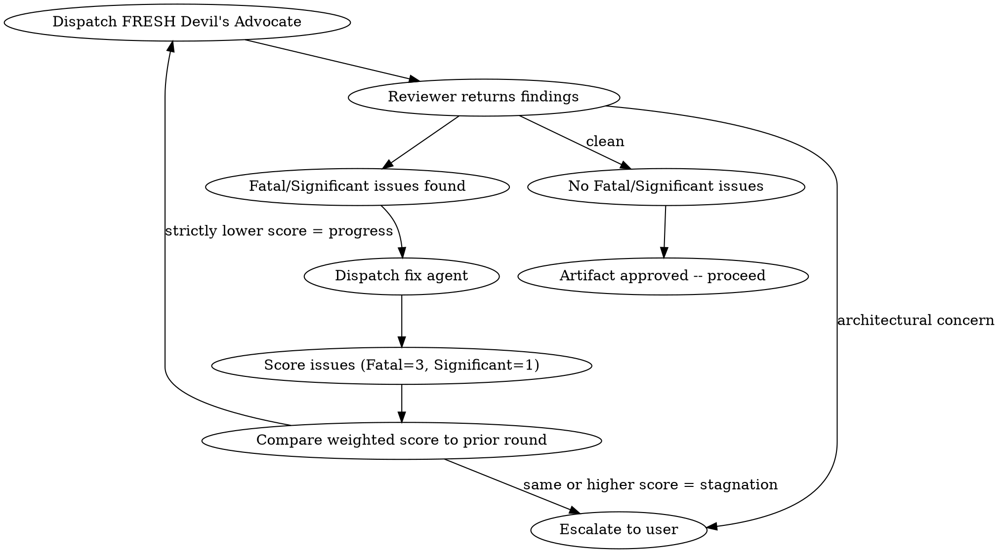

# Red Team

## Overview

Adversarial review of any artifact. Dispatches a Devil's Advocate subagent to attack the work, fixes findings, then dispatches a FRESH Devil's Advocate to attack again. Iterates until clean or stagnation is detected.

**Core principle:** Fresh eyes every round. No anchoring, no confirmation bias.

**Announce at start:** "I'm using the red-team skill to adversarially review this artifact."

## When to Use

- After a design doc is finalized (before planning)
- After an implementation plan passes review (before execution)
- After implementation is complete (before finishing)
- Anytime you want adversarial review of any artifact
- When the build pipeline calls for red-teaming

## The Iterative Loop



### Rules

1. **Fresh reviewer every round** — dispatch a NEW subagent each time. Never pass prior findings to the next reviewer. Each reviewer sees the artifact cold.
2. **Stagnation = escalation** — use weighted scoring to detect stagnation (see below). If the weighted score does not strictly decrease, stop and escalate to user with full findings from both rounds.
3. **Architectural concerns bypass the loop** — immediate escalation regardless of round or progress.
4. **No round cap** — loop as long as each round makes progress. The caller (e.g., `crucible:quality-gate`) may impose a global safety limit.
5. **Only Fatal and Significant count** — Minor observations are logged but don't count toward stagnation and don't trigger fix rounds.

### Stagnation Detection

Stagnation uses **weighted scoring**, not raw issue counts. This prevents false stagnation when Fatal issues are converted to Significant ones (which is genuine progress).

**Weights:** Fatal = 3 points, Significant = 1 point.

**Example:** Round 1 finds 2 Fatal + 1 Significant = score 7. Fixer eliminates both Fatals but surfaces 3 new Significants. Round 2 finds 0 Fatal + 3 Significant = score 3. That is progress (3 < 7), not stagnation.

**Progress requires EITHER:**
- Weighted score strictly lower than prior round, OR
- Fatal count strictly lower AND weighted score same-or-lower

**If neither condition is met, that is stagnation.** Escalate to user with findings from both rounds.

### Issue Classification

The Devil's Advocate MUST classify every challenge:
- **Fatal:** Artifact will fail or produce broken output. Must be addressed.
- **Significant:** Artifact will work but has a meaningful risk or missed opportunity. Should be addressed.
- **Minor:** Nitpick or preference. Log it but don't block.

## How to Use

### 1. Determine artifact type and fix mechanism

| Artifact | Fix Mechanism |
|---|---|
| Design doc | Plan Writer subagent revises the doc |
| Implementation plan | Plan Writer subagent revises the plan |
| Code / implementation | Fix subagent (new, not the original implementer) |
| Documentation | Fix subagent |
| Standalone invocation | Caller decides |

### 2. Dispatch Devil's Advocate

Use the `red-team-prompt.md` template in this directory. Provide:
- The full artifact content (paste it, don't make the subagent read files)
- Project context (existing systems, constraints, tech stack)
- What the artifact is supposed to accomplish

Model: **Opus** (adversarial analysis needs the best model)

### 3. Process findings

- **No Fatal/Significant issues:** Artifact is approved. Proceed.
- **Fatal/Significant issues found:** Compute the weighted score (Fatal=3, Significant=1). Dispatch fix mechanism. Then go to step 4.
- **Architectural concerns:** Escalate to user immediately. Do not attempt to fix.

### 4. Re-review after fixes

Dispatch a NEW Devil's Advocate subagent (fresh, no prior context). Compute weighted score and compare:
- **Strictly lower weighted score:** Progress. Loop back to step 3.
- **Same or higher weighted score:** Stagnation. Escalate to user with findings from both rounds.

## What the Devil's Advocate is NOT

- A code reviewer (don't check style, naming, or quality — that's `crucible:code-review`)
- A blocker for the sake of blocking — challenges must be specific and actionable
- A rewriter — they challenge, they don't produce an alternative

## Depth Calibration

If a reviewer returns fewer findings than expected, the review is likely shallow. Dispatch a second reviewer with the instruction: "A prior reviewer found N issues. Find what they missed."

| Artifact | Expected findings (Fatal + Significant) | Minimum dimensions covered |
|---|---|---|
| Design doc | 5-10 | All 6 |
| Implementation plan | 3-8 | Fatal Flaws, Hidden Risks, Fragility, Assumptions |
| Code (feature) | 3-6 | Fatal Flaws, Hidden Risks, Fragility |
| Code (refactor) | 2-5 | Fatal Flaws, Assumptions, Completeness |

These are guidelines, not quotas. A genuinely clean artifact with 1 finding and thorough dimension coverage is fine. A 1-finding review that only addresses one dimension is shallow regardless of the artifact.

## The Iron Law

```
No artifact ships without adversarial review.
Code review is necessary but not sufficient.
```

Code review checks quality — is the code correct, clean, well-structured? Red-teaming attacks assumptions — will this actually work under adversarial conditions? What happens when inputs are hostile, dependencies fail, or load exceeds expectations? These are non-overlapping concerns. Passing code review is not evidence that red-teaming is unnecessary.

## Rationalization Prevention

| Excuse | Reality |
|--------|---------|
| "Code review already passed" | Code review and red-teaming have non-overlapping coverage. Review checks quality; red-teaming attacks assumptions under adversarial conditions. Both are required. |
| "This is a minor change" | Minor changes in critical paths have disproportionate blast radius. Small diffs are where subtle bugs hide — less code to review means less obvious where to look. |
| "We're behind schedule" | Skipping adversarial review saves hours now, costs days when the issue surfaces in production. Red-teaming is the cheapest place to find these issues. |
| "The design was thorough" | Thorough designs have thorough failure modes. Complexity = attack surface. The more thought went in, the more assumptions to challenge. |
| "Just a refactor, behavior unchanged" | Refactors are where equivalence assumptions hide. Red-team verifies the equivalence claim — the most dangerous bugs are ones where "nothing changed" but something did. |
| "Quality gate will catch it later" | Quality gate invokes red-team. Skipping here means skipping there. |
| "The inquisitor already tested it" | Inquisitor writes executable tests for cross-component behavior. Red-team attacks design assumptions and failure modes that can't be expressed as tests. Different tools. |
| "We already did N rounds" | Prior rounds found things to fix. That's evidence the artifact needed review, not evidence it's now clean. Fresh eyes, every round. |

## Red Flags

**Process violations — Never:**
- Reuse the same reviewer subagent across rounds
- Pass prior findings to the next reviewer
- Skip re-review after fixes ("the fixes look fine, let's move on")
- Ignore Fatal issues
- Proceed with unfixed Significant issues

**Skip rationalizations — STOP if you catch yourself thinking:**
- "This artifact doesn't need adversarial review"
- "The scope is too small for red-teaming"
- "We're running behind, skip this pass"
- "Code review / inquisitor already covered this"
- "The user said to skip it" (the user can override, but name the risk explicitly first)

## Dual-Mode Operation

Red-team operates in two modes depending on the caller:

**When invoked by `crucible:quality-gate`:** Run **single-pass only**. Return findings for this round. Do NOT iterate, do NOT apply stagnation detection, do NOT dispatch fix agents. Quality-gate owns the loop, stagnation detection, and fix dispatch. You are a reviewer, not a coordinator.

**When invoked directly** (e.g., by `crucible:finish` or standalone): Run the **full iterative loop** with stagnation detection, fix dispatch, and escalation as described above.

**Multi-model consensus:** When invoked by quality-gate on consensus-eligible rounds, quality-gate handles the multi-model dispatch via the consensus MCP tool. Red-team itself does not call consensus — the quality-gate orchestrator substitutes a consensus call for the red-team dispatch on eligible rounds. When invoked standalone, red-team uses single-model dispatch only.

## Integration

**Called by:**
- **crucible:quality-gate** — at each gate point (single-pass mode). Build invokes quality-gate, which invokes red-team.
- **crucible:finish** — before presenting options (full loop mode, directly, not via quality-gate)

**Pairs with:**
- **crucible:innovate** — innovate runs before red-team at each gate

See prompt template: `red-team/red-team-prompt.md`
